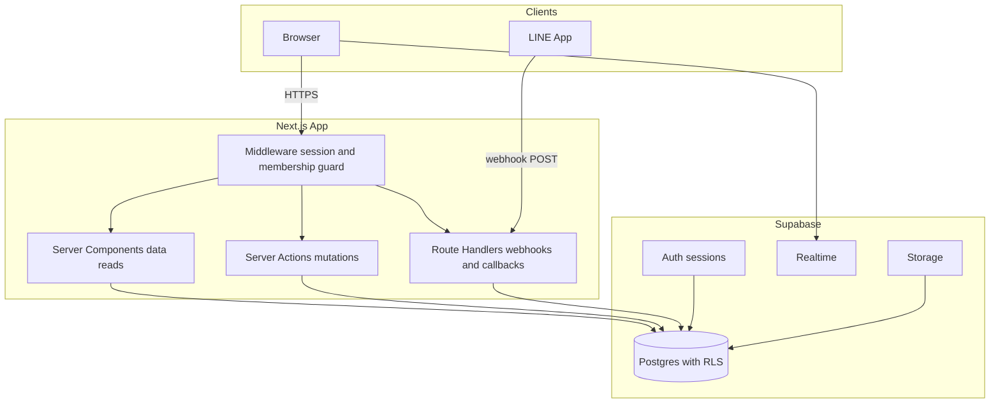
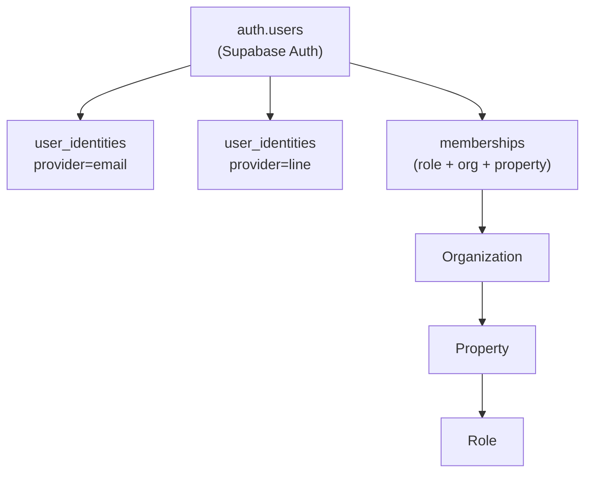
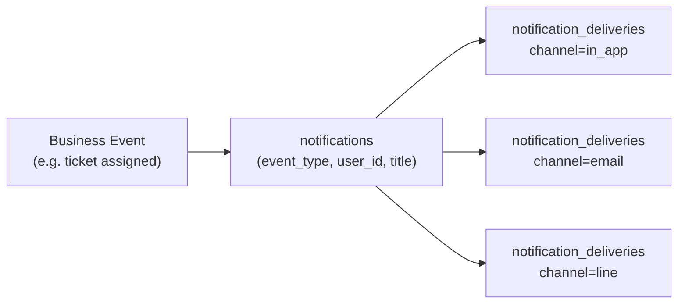
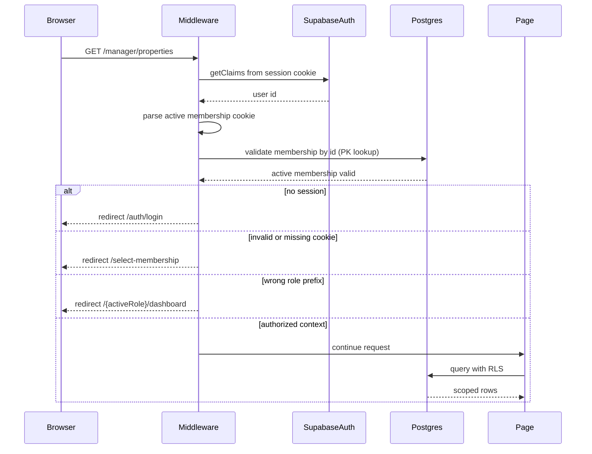
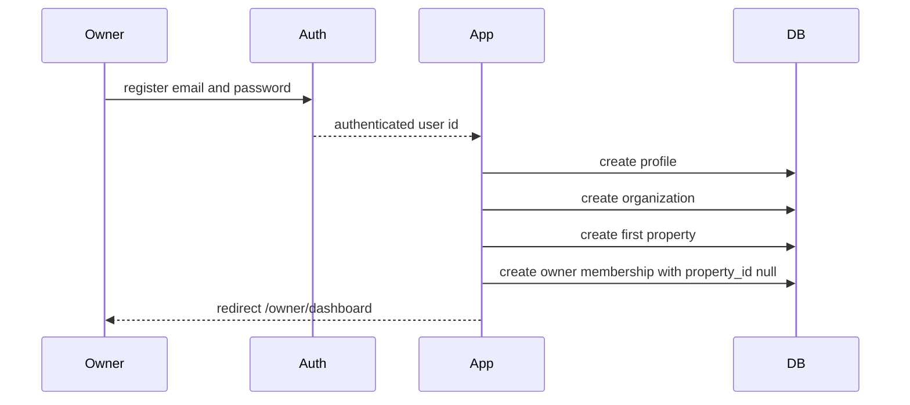
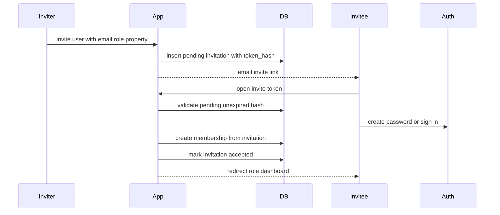
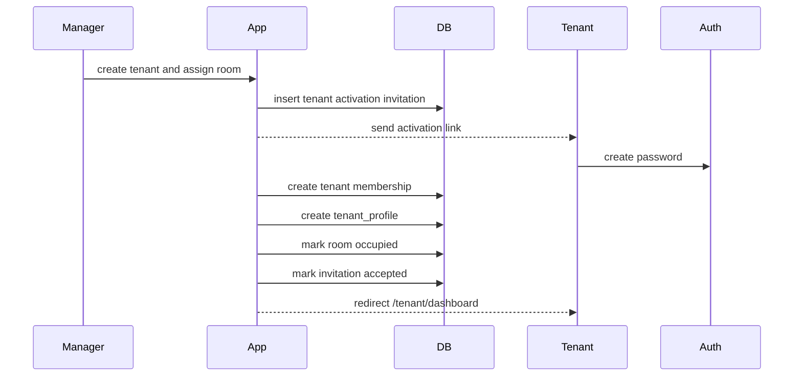
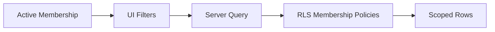

# 02 - System Architecture

## 1. Overview

Habio is a multi-property dormitory management SaaS built on Next.js and Supabase. A single deployment serves many organizations, and each organization can own many properties, buildings, and rooms.

| Layer | Technology |
|---|---|
| Frontend / SSR | Next.js App Router, React, Tailwind, shadcn/ui |
| Backend | Server Components, Server Actions, Route Handlers |
| Database | Supabase Postgres with RLS |
| Auth | Supabase Auth with cookie-based sessions |
| Realtime | Supabase Realtime |
| Storage | Supabase Storage for ticket attachments |
| Messaging | LINE Messaging API |
| Hosting | Vercel and Supabase Cloud |

## 2. High-Level Architecture

## 3. Identity and Authorization

Supabase Auth identifies the user. Habio authorization is resolved from `memberships`.

- `profiles`: display and contact data only.
- `memberships`: role, organization scope, property scope, active/deactivated state.
- `invitations`: pending access grants for staff and tenant activation.
- `tenant_profiles`: tenant lease and room metadata.

A user can hold multiple active memberships, so the app must track an active membership context for route and UI state.

## 3.1 User Identity Layer

Supabase Auth creates a user in `auth.users`. Habio stores provider-specific identity records in `user_identities` — one row per linked provider.

**Core rule:** identity proves who you are; membership proves what you can do. These are independent.

| Concern | Table | Notes |
|---|---|---|
| Who the user is | `user_identities` | One row per provider per user |
| What the user can access | `memberships` | One row per role+org+property grant |

Supported providers: `email`, `line`. Future providers (`google`, `apple`) add rows to `user_identities` with no schema changes required.

LINE identity association requires an explicit link action after authentication. Deactivating a membership does not remove a LINE identity. Removing a LINE identity does not deactivate a membership.

## 3.2 Notification Architecture (Future)

Notifications are stored channel-independently. Delivery state is tracked separately per channel. This allows Phase 5 to wire LINE delivery without schema changes.

Notification event types:
- `maintenance_ticket_assigned`
- `maintenance_ticket_updated`
- `housekeeping_task_assigned`
- `bill_created`
- `bill_due`
- `tenant_activated`
- `meter_reading_approved`

Delivery channels: `in_app` (Phase 1), `email` (Phase 3), `line` (Phase 5).

The `notifications` and `notification_deliveries` tables are created in Phase 0 (schema only). Delivery logic is not implemented until Phase 1 (`in_app`) and Phase 5 (`line`).

## 4. Authenticated Request Lifecycle

## 5. Authentication Flows

### 5.1 Owner Registration

The first user of an organization becomes `owner`. This is the only self-registration path that creates Habio access directly.

### 5.2 Invitation Acceptance

Managers, technicians, and housekeepers do not self-register into an organization.

### 5.3 Tenant Activation

Managers create tenants and assign rooms. Tenants receive an activation link and set a password.

## 6. Middleware and Context Cookie

`habio-active-membership` is an HMAC-signed cache containing:

- `user_id`
- `membership_id`
- `organization_id`
- `property_id`
- `role`
- `expires_at`

The cookie supports fast route redirects, but it is not a security boundary. On the default request path, middleware validates the signed `membership_id` with a single primary-key lookup (`validateMembershipById`). The full membership list loads only on `/select-membership` or after an explicit context switch. Server actions revalidate writes against the database.

## 7. Data Access Pattern

Server Components and Server Actions should include the active membership context in query filters for performance, but RLS remains authoritative.

## 8. Realtime and Notifications

Realtime subscriptions must be scoped to the authenticated user or active property:

- Notifications: `user_id = auth.uid()`.
- Maintenance tickets: property managers see assigned property tickets; technicians see assigned tickets.
- Housekeeping tasks: managers see property tasks; housekeepers see assigned tasks.
- Meter readings: managers and housekeepers use property-scoped membership checks.

## 9. Storage

Ticket attachments remain in Supabase Storage. Storage policies must mirror `maintenance_tickets` access: tenant owns the ticket, assigned technician can read related attachments, and owner/manager can access tickets in scoped properties.

## 10. Security Constraints

- Never trust `raw_user_meta_data`, route prefix, email domain, or client-selected organization IDs for authorization.
- All public tables use RLS.
- Invitation tokens are single-use and stored as hashes.
- Server-only flows use the service role key only in Route Handlers or Server Actions and never expose it to clients.
- `SECURITY DEFINER` helper functions must include `auth.uid()` predicates and fixed `search_path`.
