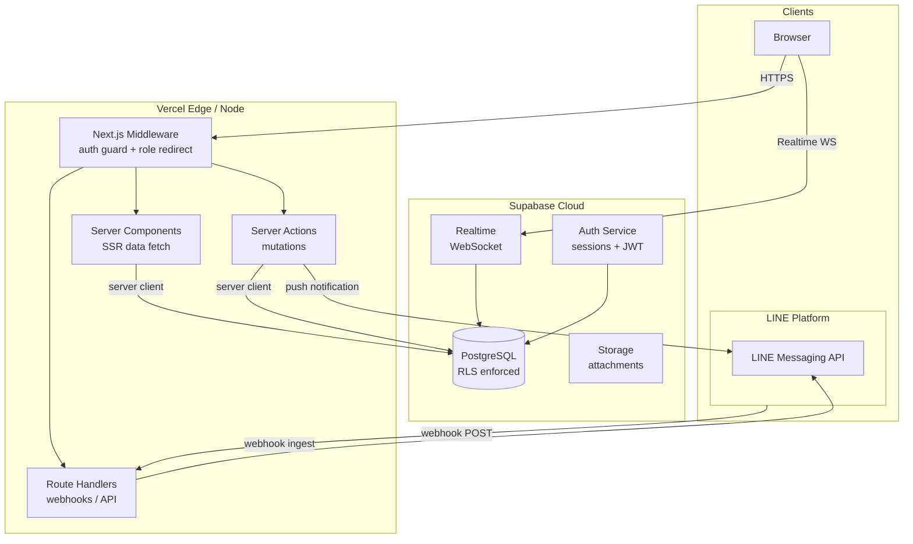
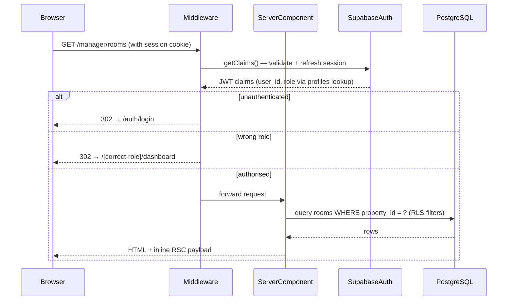
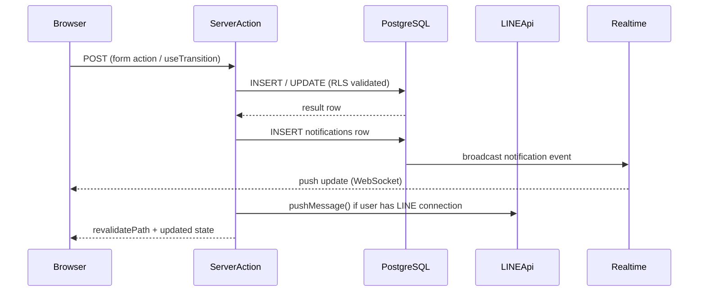
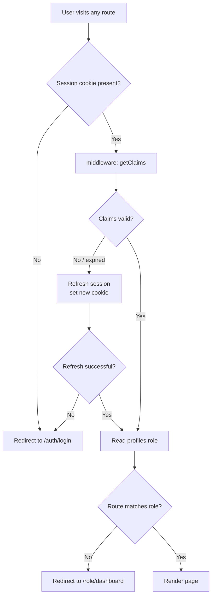
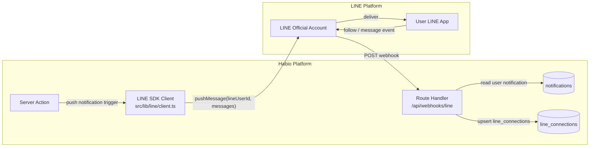
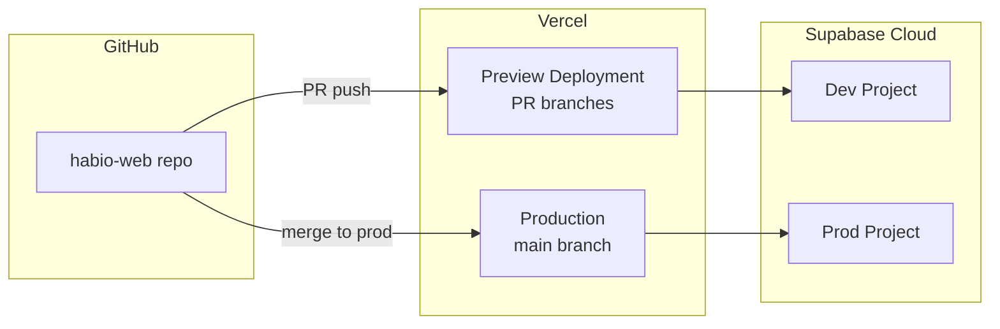

# 02 — System Architecture

## 1. Overview

Habio is a full-stack SaaS application built on the following foundational services:

| Layer | Technology |
|---|---|
| Frontend / SSR | Next.js 16 (App Router), React 19, Tailwind CSS 4, shadcn/ui |
| Backend (BFF) | Next.js Server Components, Server Actions, Route Handlers |
| Database | Supabase (PostgreSQL 15) |
| Auth | Supabase Auth (email/password, cookie-based sessions) |
| Realtime | Supabase Realtime (WebSocket channels) |
| Storage | Supabase Storage (maintenance ticket attachments) |
| Messaging | LINE Messaging API |
| Hosting | Vercel (Next.js), Supabase Cloud |

---

## 2. High-Level Architecture



---

## 3. Request Lifecycle

### 3.1 Authenticated Page Request



### 3.2 Mutation via Server Action



---

## 4. Authentication Flow



### Session Storage

- Supabase Auth issues a JWT (access token) + refresh token
- Both stored as HTTP-only cookies via `@supabase/ssr` `setAll` / `getAll` cookie adapters
- `getClaims()` is called at the top of every middleware invocation to refresh tokens before any data fetch — never skipped
- Role is **not** embedded in the JWT; it is read from `profiles.role` on the server via a privileged lookup after claims are validated

---

## 5. Multi-Tenancy Model

Habio uses a **shared database, shared schema** multi-tenancy model:

- Every table that belongs to a property includes a `property_id` column
- Row Level Security policies on every table restrict reads and writes to rows the authenticated user owns or is assigned to
- A manager only sees data for properties where `properties.manager_id = auth.uid()`
- There is no schema-per-tenant isolation; isolation is purely via RLS

---

## 6. LINE Messaging API Integration



**Outbound (Habio → LINE):**
1. A Server Action triggers a notification (e.g., bill issued, ticket assigned)
2. Server Action inserts a row into `notifications`
3. After DB write, Server Action checks `line_connections` for the target user
4. If a LINE connection exists, calls LINE SDK `pushMessage()` with the notification body
5. Failure to send LINE message is non-fatal — in-app notification is always persisted

**Inbound (LINE → Habio):**
1. User follows the LINE Official Account or sends a message
2. LINE platform POSTs a webhook event to `/api/webhooks/line`
3. Route Handler verifies HMAC-SHA256 signature using `LINE_CHANNEL_SECRET`
4. On `follow` event: upsert `line_connections` linking `line_user_id` to `profiles.id`
5. On `message` event (future): allow tenants to query bill status or submit basic tickets via chat

---

## 7. Realtime Architecture

Supabase Realtime is used for two scenarios:

| Channel | Event | Subscriber |
|---|---|---|
| `notifications:user_id=<uid>` | `INSERT` on `notifications` | All roles — drives notification badge count |
| `tickets:property_id=<pid>` | `INSERT`, `UPDATE` on `maintenance_tickets` | Manager — live ticket board updates |
| `tasks:assigned_to=<uid>` | `INSERT`, `UPDATE` on `housekeeping_tasks` | Housekeeper — live task list |

Clients subscribe using the Supabase browser client inside a `useEffect` hook. The subscription is established after initial page load and torn down on unmount.

---

## 8. Storage Architecture

Supabase Storage is used for maintenance ticket photo attachments:

- Bucket: `ticket-attachments` (private)
- Path pattern: `{property_id}/{ticket_id}/{filename}`
- Upload: client-side via signed upload URL issued by a Server Action
- Access: time-limited signed download URL generated on-demand
- Max file size: 10 MB per attachment, max 5 attachments per ticket

---

## 9. Deployment Architecture



- **Production**: `prod` branch auto-deploys to Vercel production; points to production Supabase project
- **Preview**: Every PR gets a Vercel preview URL; points to the development Supabase project
- **Migrations**: Applied via Supabase CLI in CI before deployment (`supabase db push`)
- **Secrets**: Stored in Vercel environment variables; never committed

---

## 10. Key Architectural Constraints

| Constraint | Rationale |
|---|---|
| No client-side data fetching for initial page load | All initial data is server-rendered via Server Components to avoid layout shift and improve TTI |
| Server Actions for all mutations | Avoids a separate REST API layer; actions run on the server, RLS is always enforced |
| `getClaims()` must be first call in middleware | Supabase requirement — skipping causes random session termination |
| Role not in JWT | Role changes take effect immediately without requiring token rotation |
| RLS as final enforcement layer | Middleware redirects are UX conveniences; RLS is the security guarantee |

---

## 11. Role Cache Cookie

Without caching, every HTTP request incurs two Supabase calls: `getClaims()` (local) and a `SELECT role FROM profiles` DB round-trip. At 100 concurrent users navigating 5 pages/minute this produces 500 DB queries/minute purely for role lookups.

To eliminate the repeat DB fetch, the resolved role is stored in a short-lived, HMAC-signed HTTP-only cookie alongside the session cookie.

### Design

```
Cookie name:  habio-role-cache
Value:        base64url( JSON { role, uid, exp } ) . HMAC-SHA256( payload, ROLE_CACHE_SECRET )
TTL:          10 minutes (Max-Age=600, same SameSite/Secure attributes as session cookie)
```

### Middleware Logic (with cache)

```typescript
// src/middleware.ts
export async function middleware(request: NextRequest) {
  // Step 1: refresh session (required first per Supabase SSR docs)
  const response = await updateSession(request)
  const supabase = createServerClient(...)

  // Step 2: validate session
  const { data } = await supabase.auth.getClaims()
  const userId = data?.claims?.sub
  if (!userId) {
    return NextResponse.redirect(new URL('/auth/login', request.url))
  }

  // Step 3: check role cache cookie (skip DB if valid)
  let role = getRoleCacheFromCookie(request, userId)

  if (!role) {
    // Cache miss: fetch from DB and set cookie on response
    const { data: profile } = await supabase
      .from('profiles')
      .select('role')
      .eq('id', userId)
      .single()
    role = profile?.role
    setRoleCacheCookie(response, userId, role)
  }

  // Step 4: role-prefix enforcement (unchanged)
  const roleRoutes = ['manager', 'tenant', 'technician', 'housekeeper']
  const requestedRole = roleRoutes.find(r => request.nextUrl.pathname.startsWith(`/${r}`))
  if (requestedRole && requestedRole !== role) {
    return NextResponse.redirect(new URL(`/${role}/dashboard`, request.url))
  }

  if (request.nextUrl.pathname === '/') {
    return NextResponse.redirect(new URL(`/${role}/dashboard`, request.url))
  }

  return response
}
```

### Cache Invalidation

| Event | Action |
|---|---|
| Role change (manager promotes a user) | Server Action clears `habio-role-cache` cookie by setting `Max-Age=0` |
| Session expiry / sign-out | Auth cookie cleared; cache cookie also cleared in `signOut` action |
| Cache TTL expiry (10 min) | Next middleware invocation triggers DB re-fetch automatically |

### Environment Variable

| Variable | Description |
|---|---|
| `ROLE_CACHE_SECRET` | 32-byte random secret used to HMAC-sign the cache payload. Server-only — never `NEXT_PUBLIC_`. |

### Security Properties

- HMAC signature prevents client tampering with the cached role
- Short TTL (10 min) bounds the window for a stale role after a change
- RLS remains the authoritative enforcement layer — a stale cache at worst causes a wrong-role redirect, never data leakage
