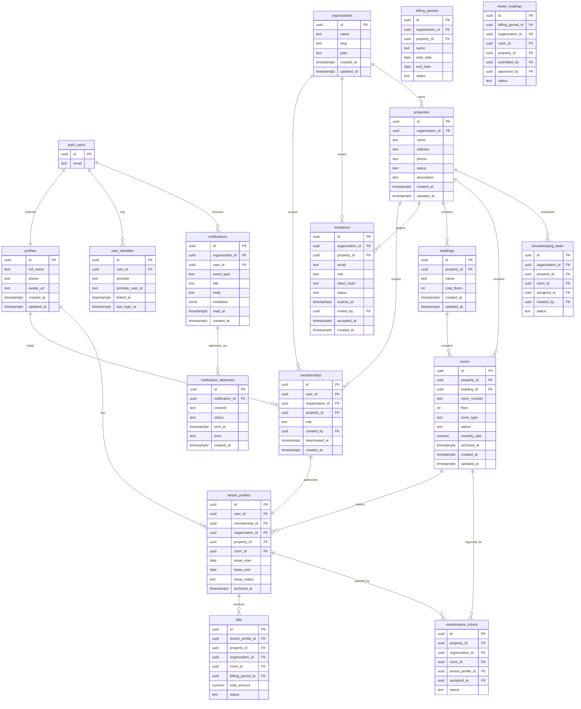

# 03 - Database Schema

## 1. Design Principles

- Supabase Auth owns identity in `auth.users`; Habio owns application profile and authorization data in `public`.
- Do not store roles on users. `profiles` contains display/contact data only.
- `memberships` is the single source of truth for access. A user may hold multiple roles across properties and organizations.
- `organization_id` scopes every membership and invitation. `property_id` is nullable only for organization-level owner access.
- Non-owner accounts are created through invitations or activation links. Managers, technicians, housekeepers, and tenants cannot self-register into an organization.
- `organization_id` and `property_id` are denormalized on operational tables so RLS can filter by org and property without deep joins.
- Tenant lease metadata lives in `tenant_profiles`; tenant authorization lives in the matching tenant membership.
- Use soft deactivation (`deactivated_at`, `archived_at`) for access and lease history instead of deleting business records.
- Every mutable table has `created_at` and `updated_at`; `updated_at` is maintained by trigger.
- All public tables exposed through Supabase APIs must have RLS enabled.

## 2. Entity Relationship Diagram



## 3. Custom Types

```sql
create type membership_role as enum (
  'owner',
  'manager',
  'technician',
  'housekeeper',
  'tenant'
);

create type invitation_status as enum (
  'pending',
  'accepted',
  'expired',
  'revoked'
);

create type room_type as enum ('single', 'double', 'studio', 'suite');
create type room_status as enum ('available', 'occupied', 'maintenance');
create type lease_status as enum ('active', 'expiring', 'expired', 'terminated');
create type bill_status as enum ('draft', 'pending', 'paid', 'overdue');
create type ticket_priority as enum ('low', 'medium', 'high', 'urgent');
create type ticket_status as enum ('open', 'in_progress', 'resolved', 'closed');
create type task_status as enum ('pending', 'in_progress', 'completed', 'skipped');
create type property_status as enum ('active', 'inactive', 'archived');
create type billing_period_status as enum ('open', 'closed', 'archived');
create type meter_reading_status as enum ('pending', 'submitted', 'approved', 'rejected');
```

## 4. Core Tables

### 4.1 `profiles`

```sql
create table public.profiles (
  id uuid primary key references auth.users(id) on delete cascade,
  full_name text not null,
  phone text,
  avatar_url text,
  created_at timestamptz not null default now(),
  updated_at timestamptz not null default now()
);
```

`profiles` must not contain `role`, `organization_id`, or authorization claims. Reading role from `raw_user_meta_data` is forbidden because that metadata is user-controlled.

### 4.2 `organizations`

```sql
create table public.organizations (
  id uuid primary key default gen_random_uuid(),
  name text not null,
  slug text not null unique,
  plan text not null default 'free',
  created_at timestamptz not null default now(),
  updated_at timestamptz not null default now()
);
```

Ownership is derived from `memberships(role = 'owner', property_id is null)`, not an `owner_id` column.

### 4.3 `properties`

```sql
create table public.properties (
  id uuid primary key default gen_random_uuid(),
  organization_id uuid not null references public.organizations(id) on delete restrict,
  name text not null,
  address text not null,
  phone text,
  status property_status not null default 'active',
  description text,
  created_at timestamptz not null default now(),
  updated_at timestamptz not null default now()
);

create index idx_properties_organization_id on public.properties (organization_id);
create index idx_properties_status on public.properties (organization_id, status);
```

Managers are assigned through property-scoped memberships. A property may have multiple managers.

### 4.4 `memberships`

```sql
create table public.memberships (
  id uuid primary key default gen_random_uuid(),
  user_id uuid not null references public.profiles(id) on delete cascade,
  organization_id uuid not null references public.organizations(id) on delete cascade,
  property_id uuid references public.properties(id) on delete cascade,
  role membership_role not null,
  created_by uuid references public.profiles(id) on delete set null,
  deactivated_at timestamptz,
  created_at timestamptz not null default now(),
  constraint memberships_scope_check check (
    (role = 'owner' and property_id is null)
    or (role <> 'owner' and property_id is not null)
  )
);

-- PostgreSQL treats NULL != NULL in table-level UNIQUE constraints, so owner rows
-- (property_id IS NULL) are not deduplicated by a single composite unique.
-- Use partial unique indexes instead:
create unique index memberships_owner_unique
  on public.memberships (user_id, organization_id)
  where role = 'owner' and property_id is null and deactivated_at is null;

create unique index memberships_property_role_unique
  on public.memberships (user_id, organization_id, property_id, role)
  where property_id is not null and deactivated_at is null;

create index idx_memberships_user_active
  on public.memberships (user_id, role, organization_id, property_id)
  where deactivated_at is null;

create index idx_memberships_org_role
  on public.memberships (organization_id, role)
  where deactivated_at is null;

create index idx_memberships_property_role
  on public.memberships (property_id, role)
  where deactivated_at is null;

create index idx_memberships_created_by
  on public.memberships (created_by);
```

Role scoping:

| Role | Scope | `property_id` | Notes |
|---|---|---:|---|
| `owner` | Organization | null | Full organization access |
| `manager` | Property | required | One row per managed property |
| `technician` | Property | required | May belong to multiple properties |
| `housekeeper` | Property | required | May belong to multiple properties |
| `tenant` | Property | required | Lease details live in `tenant_profiles` |

### 4.5 `invitations`

```sql
create table public.invitations (
  id uuid primary key default gen_random_uuid(),
  organization_id uuid not null references public.organizations(id) on delete cascade,
  property_id uuid references public.properties(id) on delete cascade,
  email citext not null,
  role membership_role not null check (role in ('manager', 'technician', 'housekeeper', 'tenant')),
  token_hash text not null unique,
  status invitation_status not null default 'pending',
  expires_at timestamptz not null,
  invited_by uuid not null references public.profiles(id) on delete restrict,
  accepted_at timestamptz,
  created_at timestamptz not null default now(),
  -- All invited roles are property-scoped; org-level invites are not supported.
  constraint invitations_property_scope_check check (property_id is not null)
);

create index idx_invitations_email_status on public.invitations (lower(email), status);
create index idx_invitations_org_status on public.invitations (organization_id, status, created_at desc);
create index idx_invitations_property_role on public.invitations (property_id, role, status);
```

Store a hash of the token, not the raw token. The raw token should exist only in the email link and in memory during validation.

### 4.6 `buildings` and `rooms`

```sql
create table public.buildings (
  id uuid primary key default gen_random_uuid(),
  property_id uuid not null references public.properties(id) on delete cascade,
  name text not null,
  total_floors integer not null default 1 check (total_floors >= 1),
  created_at timestamptz not null default now(),
  updated_at timestamptz not null default now(),
  unique (property_id, name)
);

create table public.rooms (
  id uuid primary key default gen_random_uuid(),
  property_id uuid not null references public.properties(id) on delete cascade,
  building_id uuid not null references public.buildings(id) on delete restrict,
  room_number text not null,
  floor integer not null default 1,
  room_type room_type not null default 'single',
  status room_status not null default 'available',
  monthly_rate numeric(10, 2) not null check (monthly_rate >= 0),
  notes text,
  archived_at timestamptz,
  created_at timestamptz not null default now(),
  updated_at timestamptz not null default now(),
  unique (building_id, room_number)
);
```

`rooms.property_id` is denormalized from `buildings.property_id` for RLS and list query performance.

### 4.7 `tenant_profiles`

```sql
create table public.tenant_profiles (
  id uuid primary key default gen_random_uuid(),
  user_id uuid not null references public.profiles(id) on delete restrict,
  membership_id uuid not null references public.memberships(id) on delete restrict,
  organization_id uuid not null references public.organizations(id) on delete restrict,
  property_id uuid not null references public.properties(id) on delete restrict,
  room_id uuid not null references public.rooms(id) on delete restrict,
  lease_start date not null,
  lease_end date,
  lease_status lease_status not null default 'active',
  emergency_contact_name text,
  emergency_contact_phone text,
  notes text,
  archived_at timestamptz,
  created_at timestamptz not null default now(),
  updated_at timestamptz not null default now(),
  unique (membership_id)
);

create index idx_tenant_profiles_user_id on public.tenant_profiles (user_id);
create index idx_tenant_profiles_organization_id on public.tenant_profiles (organization_id);
create index idx_tenant_profiles_property_id on public.tenant_profiles (property_id);
create index idx_tenant_profiles_room_id on public.tenant_profiles (room_id);
create index idx_tenant_profiles_lease_status on public.tenant_profiles (property_id, lease_status);

create unique index tenant_profiles_one_active_per_room
  on public.tenant_profiles (room_id)
  where lease_status = 'active' and archived_at is null;
```

A tenant activation accepts an invitation, creates a tenant membership, creates the tenant profile, and marks the room occupied in one transaction.

### 4.8 `user_identities`

Stores provider-specific identity records for each user. One row per linked provider. Supports email, LINE, and future providers (Google, Apple) without schema changes.

```sql
create table public.user_identities (
  id               uuid        primary key default gen_random_uuid(),
  user_id          uuid        not null references auth.users(id) on delete cascade,
  provider         text        not null
                               check (provider in ('email','line','google','apple')),
  provider_user_id text        not null,
  linked_at        timestamptz not null default now(),
  last_login_at    timestamptz,
  created_at       timestamptz not null default now(),
  updated_at       timestamptz not null default now(),
  unique (provider, provider_user_id)
);

create index on public.user_identities (user_id);
```

RLS:
- Users can read and manage their own identity rows.
- Owners can read identity rows for members of their organization (for LINE verification status display).
- No cross-user writes permitted.

Identity rows are inert without a matching membership. Removing an identity row does not affect membership. Deactivating a membership does not remove identity rows.

## 5. Operational Tables

Operational tables keep their existing structure with these relationship updates:

| Table | Required scope columns | Authorization reference |
|---|---|---|
| `billing_periods` | `organization_id`, `property_id` | Owner or manager membership |
| `meter_readings` | `organization_id`, `property_id`, `room_id` | Owner/manager review; housekeeper property membership for submit |
| `bills` | `organization_id`, `property_id`, `room_id`, `tenant_profile_id` | Owner/manager; tenant owns matching tenant profile |
| `maintenance_tickets` | `organization_id`, `property_id`, `room_id`, `tenant_profile_id`, `assigned_to` | Tenant own tickets; manager property; assigned technician |
| `housekeeping_tasks` | `organization_id`, `property_id`, `room_id`, `assigned_to`, `created_by` | Manager property; assigned housekeeper |
| `tenant_profiles` | `organization_id`, `property_id`, `room_id`, `membership_id` | Owner/manager; tenant owns own profile |
| `notifications` | `organization_id`, `user_id` | User owns notification |
| `notification_deliveries` | via `notification_id` | User owns parent notification |
| `user_identities` | `user_id` | User owns identity rows; owners may read org-member identities |

`organization_id` is denormalized on every operational table that participates in org-level RLS or analytics. Set it from the parent property at insert time via trigger or Server Action; do not rely on joins at read time.

### `notifications`

Stores notifications channel-independently. Created by server-side business logic when a triggering event occurs.

```sql
create table public.notifications (
  id              uuid        primary key default gen_random_uuid(),
  organization_id uuid        not null references public.organizations(id),
  user_id         uuid        not null references auth.users(id),
  event_type      text        not null,
  title           text        not null,
  body            text,
  metadata        jsonb,
  read_at         timestamptz,
  created_at      timestamptz not null default now()
);

create index on public.notifications (user_id, created_at desc);
create index on public.notifications (organization_id);
```

Valid `event_type` values: `maintenance_ticket_assigned`, `maintenance_ticket_updated`, `housekeeping_task_assigned`, `bill_created`, `bill_due`, `tenant_activated`, `meter_reading_approved`.

### `notification_deliveries`

Tracks delivery state per channel for each notification. A single notification may have up to one delivery row per channel.

```sql
create table public.notification_deliveries (
  id              uuid        primary key default gen_random_uuid(),
  notification_id uuid        not null references public.notifications(id) on delete cascade,
  channel         text        not null
                              check (channel in ('in_app','email','line')),
  status          text        not null default 'pending'
                              check (status in ('pending','sent','failed','skipped')),
  sent_at         timestamptz,
  error           text,
  created_at      timestamptz not null default now(),
  unique (notification_id, channel)
);

create index on public.notification_deliveries (notification_id);
```

RLS: users can read `notifications` and `notification_deliveries` for their own `user_id`. No direct user writes; rows are created by server actions.

`property_staff` is removed. Assignment actions check that the target assignee has an active `technician` or `housekeeper` membership for the same `property_id`.

### `notifications`

Stores notifications channel-independently. Created by server-side business logic when a triggering event occurs.

```sql
create table public.notifications (
  id              uuid        primary key default gen_random_uuid(),
  organization_id uuid        not null references public.organizations(id),
  user_id         uuid        not null references auth.users(id),
  event_type      text        not null,
  title           text        not null,
  body            text,
  metadata        jsonb,
  read_at         timestamptz,
  created_at      timestamptz not null default now()
);

create index on public.notifications (user_id, created_at desc);
create index on public.notifications (organization_id);
```

Valid `event_type` values: `maintenance_ticket_assigned`, `maintenance_ticket_updated`, `housekeeping_task_assigned`, `bill_created`, `bill_due`, `tenant_activated`, `meter_reading_approved`.

### `notification_deliveries`

Tracks delivery state per channel for each notification. A single notification may have up to one delivery row per channel.

```sql
create table public.notification_deliveries (
  id              uuid        primary key default gen_random_uuid(),
  notification_id uuid        not null references public.notifications(id) on delete cascade,
  channel         text        not null
                              check (channel in ('in_app','email','line')),
  status          text        not null default 'pending'
                              check (status in ('pending','sent','failed','skipped')),
  sent_at         timestamptz,
  error           text,
  created_at      timestamptz not null default now(),
  unique (notification_id, channel)
);

create index on public.notification_deliveries (notification_id);
```

RLS: users can read `notifications` and `notification_deliveries` for their own `user_id`. No direct user writes; rows are created by server actions.

## 6. RLS Helper Functions

Policy helper functions should be small, indexed, and auditable. Use `(select auth.uid())` inside helper SQL, and avoid reading user-controlled JWT metadata for authorization.

```sql
create function public.is_org_owner(p_org_id uuid)
returns boolean
language sql
stable
security definer
set search_path = public
as $$
  select exists (
    select 1
    from public.memberships m
    where m.user_id = (select auth.uid())
      and m.organization_id = p_org_id
      and m.property_id is null
      and m.role = 'owner'
      and m.deactivated_at is null
  );
$$;

create function public.has_property_role(p_property_id uuid, p_role membership_role)
returns boolean
language sql
stable
security definer
set search_path = public
as $$
  select exists (
    select 1
    from public.memberships m
    where m.user_id = (select auth.uid())
      and m.property_id = p_property_id
      and m.role = p_role
      and m.deactivated_at is null
  );
$$;

create function public.can_access_property(p_property_id uuid)
returns boolean
language sql
stable
security definer
set search_path = public
as $$
  select exists (
    select 1
    from public.properties p
    where p.id = p_property_id
      and (
        public.is_org_owner(p.organization_id)
        or exists (
          select 1
          from public.memberships m
          where m.user_id = (select auth.uid())
            and m.property_id = p_property_id
            and m.deactivated_at is null
        )
      )
  );
$$;

create function public.is_staff_role(p_role membership_role)
returns boolean
language sql
immutable
as $$
  select p_role in ('owner', 'manager', 'technician', 'housekeeper');
$$;
```

`can_access_property` is for one-time Server Action permission checks. Do not use it in row-level `USING` clauses — it joins `properties` and calls `is_org_owner` per evaluation. RLS policies should inline `is_org_owner(organization_id)` and `has_property_role(property_id, ...)` against denormalized scope columns instead.

Because `security definer` bypasses RLS, revoke default `PUBLIC` execute grants where appropriate and grant only the roles that need the helper. Keep helpers in migrations and run Supabase advisors before release.

## 7. Triggers

```sql
create or replace function public.handle_new_user()
returns trigger
language plpgsql
security definer
set search_path = public
as $$
begin
  insert into public.profiles (id, full_name)
  values (new.id, coalesce(new.raw_user_meta_data->>'full_name', new.email));
  return new;
end;
$$;

create trigger on_auth_user_created
after insert on auth.users
for each row execute function public.handle_new_user();
```

Membership integrity:

```sql
create function public.validate_membership_org_consistency()
returns trigger language plpgsql as $$
begin
  if new.property_id is not null then
    if not exists (
      select 1 from public.properties p
      where p.id = new.property_id
        and p.organization_id = new.organization_id
    ) then
      raise exception 'property_id does not belong to organization_id';
    end if;
  end if;
  return new;
end;
$$;

create trigger memberships_org_consistency
before insert or update on public.memberships
for each row execute function public.validate_membership_org_consistency();

create function public.prevent_owner_orphan()
returns trigger language plpgsql as $$
begin
  if new.deactivated_at is not null and new.role = 'owner' then
    if not exists (
      select 1 from public.memberships
      where organization_id = new.organization_id
        and role = 'owner'
        and property_id is null
        and deactivated_at is null
        and id <> new.id
    ) then
      raise exception 'cannot deactivate the last owner of an organization';
    end if;
  end if;
  return new;
end;
$$;

create trigger memberships_prevent_owner_orphan
before update of deactivated_at on public.memberships
for each row execute function public.prevent_owner_orphan();
```

Room status sync should run from `tenant_profiles` lease changes:

```sql
create trigger sync_room_on_lease_change
after insert or update of lease_status on public.tenant_profiles
for each row execute function public.sync_room_status();
```

## 7.1 Archival Tables and pg_cron Jobs

High-volume tables need scheduled archival before they affect RLS scan cost and Realtime performance.

```sql
create table public.invitations_archive (
  like public.invitations including all
);

create table public.notifications_archive (
  like public.notifications including all
);

-- Move accepted and expired invitations older than 90 days
select cron.schedule(
  'archive-old-invitations',
  '0 3 * * 0',
  $$
    with moved as (
      delete from public.invitations
      where status in ('accepted', 'expired')
        and created_at < now() - interval '90 days'
      returning *
    )
    insert into public.invitations_archive select * from moved;
  $$
);

-- Move read notifications older than 90 days
select cron.schedule(
  'archive-old-notifications',
  '0 4 * * 0',
  $$
    with moved as (
      delete from public.notifications
      where read_at is not null
        and created_at < now() - interval '90 days'
      returning *
    )
    insert into public.notifications_archive select * from moved;
  $$
);
```

Schedule both jobs in Phase 0 or Phase 1 — not after launch. At 100,000 tenants, `invitations` and `notifications` grow by hundreds of thousands of rows per quarter without archival.

## 8. Migration Strategy

| Phase | Steps |
|---|---|
| Phase 0 — identity | Create `user_identities` with RLS; `handle_new_user` inserts `email` identity row on registration. |
| Phase 0 — notifications | Create `notifications` and `notification_deliveries` — schema only; no delivery logic. |
| Additive | Create `membership_role`, `invitation_status`, `memberships`, `invitations`, and `tenant_profiles`; add compatibility columns if needed. |
| Backfill | Convert `organization_members.scope = owner` to owner memberships; convert `properties.manager_id` to manager memberships; convert `property_staff` to technician/housekeeper memberships; convert `tenants` to tenant memberships and tenant profiles. |
| Enforce | Add NOT NULL, check constraints, partial unique indexes on memberships, org-consistency and last-owner triggers, and `organization_id` on operational tables. |
| Replace RLS | Replace old helpers with membership helpers. Enable RLS on new tables before exposing them through Supabase APIs. |
| Drop legacy shape | Drop `profiles.role`, `organization_members`, `property_staff`, `properties.manager_id`, and the old `tenants` table after verification. |
| Verify | Regenerate types, update seed data, and add pgTAP tests for cross-organization and cross-property denial. |

## 9. Security Grants

```sql
revoke insert, update, delete on all tables in schema public from anon;
```

Authenticated users may keep DML grants only where RLS policies provide row-level authorization. `invitations`, tenant activation, and membership creation should be performed by server-side actions that validate the caller and run inside transactions.
