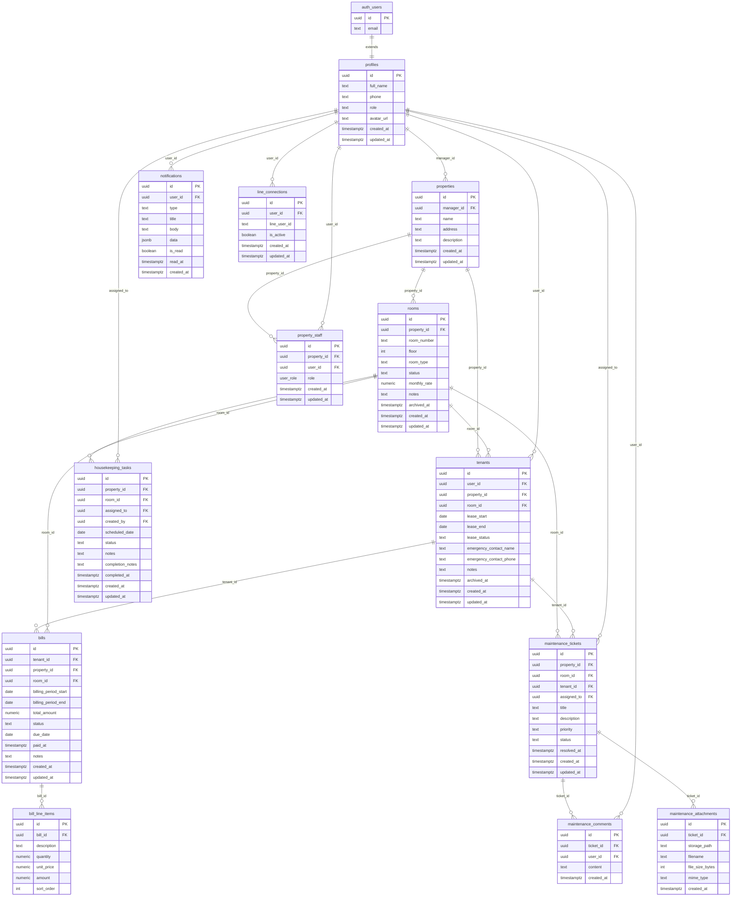

# 03 — Database Schema

## 1. Design Principles

- All tables live in the `public` schema; `auth.users` is the Supabase-managed identity table
- Every table has `id uuid DEFAULT gen_random_uuid() PRIMARY KEY`
- `created_at` and `updated_at` timestamps on every table; `updated_at` maintained by a trigger
- Soft-delete via `archived_at timestamptz` on rooms and tenants — no hard deletes
- Foreign keys reference `auth.users(id)` for user-owned rows; application profiles via `profiles(id)`
- `property_id` on every operational table enables property-scoped RLS policies
- Enum types defined as PostgreSQL custom types for type safety

---

## 2. Entity Relationship Diagram



---

## 3. Custom Types (PostgreSQL Enums)

```sql
CREATE TYPE user_role AS ENUM ('manager', 'tenant', 'technician', 'housekeeper');

CREATE TYPE room_type AS ENUM ('single', 'double', 'studio', 'suite');

CREATE TYPE room_status AS ENUM ('available', 'occupied', 'maintenance');

CREATE TYPE lease_status AS ENUM ('active', 'expiring', 'expired', 'terminated');

CREATE TYPE bill_status AS ENUM ('draft', 'pending', 'paid', 'overdue');

CREATE TYPE ticket_priority AS ENUM ('low', 'medium', 'high', 'urgent');

CREATE TYPE ticket_status AS ENUM ('open', 'in_progress', 'resolved', 'closed');

CREATE TYPE task_status AS ENUM ('pending', 'in_progress', 'completed', 'skipped');

CREATE TYPE notification_type AS ENUM (
  'bill_issued',
  'bill_overdue',
  'ticket_opened',
  'ticket_assigned',
  'ticket_status_updated',
  'ticket_comment_added',
  'task_assigned',
  'task_completed',
  'lease_expiring'
);
```

---

## 4. Table Definitions

### 4.1 `profiles`

Extends `auth.users`. Created automatically via a trigger on `auth.users` insert.

```sql
CREATE TABLE public.profiles (
  id            uuid PRIMARY KEY REFERENCES auth.users(id) ON DELETE CASCADE,
  full_name     text NOT NULL,
  phone         text,
  role          user_role NOT NULL DEFAULT 'tenant',
  avatar_url    text,
  created_at    timestamptz NOT NULL DEFAULT now(),
  updated_at    timestamptz NOT NULL DEFAULT now()
);
```

**Indexes:**
- Primary key on `id`
- Index on `role` for middleware role lookups

**Trigger:** `handle_new_user()` — inserts a row into `profiles` when a new `auth.users` row is created, using `raw_user_meta_data` for `full_name` and `role`.

---

### 4.2 `properties`

A dormitory building or campus managed by one manager.

```sql
CREATE TABLE public.properties (
  id          uuid PRIMARY KEY DEFAULT gen_random_uuid(),
  manager_id  uuid NOT NULL REFERENCES public.profiles(id) ON DELETE RESTRICT,
  name        text NOT NULL,
  address     text NOT NULL,
  description text,
  created_at  timestamptz NOT NULL DEFAULT now(),
  updated_at  timestamptz NOT NULL DEFAULT now()
);
```

**Indexes:**
- `idx_properties_manager_id` on `(manager_id)`

---

### 4.3 `rooms`

Individual rentable units within a property.

```sql
CREATE TABLE public.rooms (
  id            uuid PRIMARY KEY DEFAULT gen_random_uuid(),
  property_id   uuid NOT NULL REFERENCES public.properties(id) ON DELETE CASCADE,
  room_number   text NOT NULL,
  floor         integer NOT NULL DEFAULT 1,
  room_type     room_type NOT NULL DEFAULT 'single',
  status        room_status NOT NULL DEFAULT 'available',
  monthly_rate  numeric(10, 2) NOT NULL CHECK (monthly_rate >= 0),
  notes         text,
  archived_at   timestamptz,
  created_at    timestamptz NOT NULL DEFAULT now(),
  updated_at    timestamptz NOT NULL DEFAULT now(),
  UNIQUE (property_id, room_number)
);
```

**Indexes:**
- `idx_rooms_property_id` on `(property_id)`
- `idx_rooms_status` on `(property_id, status)` for occupancy queries

---

### 4.4 `tenants`

Links a user account to a room with lease metadata.

```sql
CREATE TABLE public.tenants (
  id                       uuid PRIMARY KEY DEFAULT gen_random_uuid(),
  user_id                  uuid NOT NULL REFERENCES public.profiles(id) ON DELETE RESTRICT,
  property_id              uuid NOT NULL REFERENCES public.properties(id) ON DELETE RESTRICT,
  room_id                  uuid NOT NULL REFERENCES public.rooms(id) ON DELETE RESTRICT,
  lease_start              date NOT NULL,
  lease_end                date,
  lease_status             lease_status NOT NULL DEFAULT 'active',
  emergency_contact_name   text,
  emergency_contact_phone  text,
  notes                    text,
  archived_at              timestamptz,
  created_at               timestamptz NOT NULL DEFAULT now(),
  updated_at               timestamptz NOT NULL DEFAULT now(),
  UNIQUE (room_id, lease_status) -- only one active lease per room enforced at app layer
);
```

**Indexes:**
- `idx_tenants_user_id` on `(user_id)`
- `idx_tenants_property_id` on `(property_id)`
- `idx_tenants_room_id` on `(room_id)`
- `idx_tenants_lease_status` on `(property_id, lease_status)`

**Partial unique index — one active lease per room:**

```sql
-- Guarantees at the database level that a room cannot have two active leases
-- simultaneously. The application-layer check in createTenant is the first line
-- of defence; this index is the hard constraint that survives concurrent inserts.
CREATE UNIQUE INDEX tenants_one_active_per_room
  ON public.tenants (room_id)
  WHERE lease_status = 'active' AND archived_at IS NULL;
```

---

### 4.5 `bills`

A billing record for one tenant for one period.

```sql
CREATE TABLE public.bills (
  id                    uuid PRIMARY KEY DEFAULT gen_random_uuid(),
  tenant_id             uuid NOT NULL REFERENCES public.tenants(id) ON DELETE RESTRICT,
  property_id           uuid NOT NULL REFERENCES public.properties(id) ON DELETE RESTRICT,
  room_id               uuid NOT NULL REFERENCES public.rooms(id) ON DELETE RESTRICT,
  billing_period_start  date NOT NULL,
  billing_period_end    date NOT NULL,
  total_amount          numeric(10, 2) NOT NULL DEFAULT 0 CHECK (total_amount >= 0),
  status                bill_status NOT NULL DEFAULT 'draft',
  due_date              date NOT NULL,
  paid_at               timestamptz,
  notes                 text,
  created_at            timestamptz NOT NULL DEFAULT now(),
  updated_at            timestamptz NOT NULL DEFAULT now(),
  CHECK (billing_period_end > billing_period_start)
);
```

**Indexes:**
- `idx_bills_tenant_id` on `(tenant_id)`
- `idx_bills_property_id` on `(property_id)`
- `idx_bills_status` on `(property_id, status)` for property-scoped status filters
- `idx_bills_overdue` on `(status, due_date)` — required by the `pg_cron` overdue-flip job (`UPDATE bills SET status = 'overdue' WHERE status = 'pending' AND due_date < CURRENT_DATE`)

---

### 4.6 `bill_line_items`

Individual line items within a bill. `total_amount` on `bills` is the sum of these.

```sql
CREATE TABLE public.bill_line_items (
  id           uuid PRIMARY KEY DEFAULT gen_random_uuid(),
  bill_id      uuid NOT NULL REFERENCES public.bills(id) ON DELETE CASCADE,
  description  text NOT NULL,
  quantity     numeric(10, 3) NOT NULL DEFAULT 1 CHECK (quantity > 0),
  unit_price   numeric(10, 2) NOT NULL CHECK (unit_price >= 0),
  amount       numeric(10, 2) GENERATED ALWAYS AS (quantity * unit_price) STORED,
  sort_order   integer NOT NULL DEFAULT 0
);
```

**Indexes:**
- `idx_bill_line_items_bill_id` on `(bill_id)`

---

### 4.7 `maintenance_tickets`

A maintenance request raised by a tenant or manager.

```sql
CREATE TABLE public.maintenance_tickets (
  id           uuid PRIMARY KEY DEFAULT gen_random_uuid(),
  property_id  uuid NOT NULL REFERENCES public.properties(id) ON DELETE RESTRICT,
  room_id      uuid NOT NULL REFERENCES public.rooms(id) ON DELETE RESTRICT,
  tenant_id    uuid REFERENCES public.tenants(id) ON DELETE SET NULL,
  assigned_to  uuid REFERENCES public.profiles(id) ON DELETE SET NULL,
  title        text NOT NULL,
  description  text,
  priority     ticket_priority NOT NULL DEFAULT 'medium',
  status       ticket_status NOT NULL DEFAULT 'open',
  resolved_at  timestamptz,
  created_at   timestamptz NOT NULL DEFAULT now(),
  updated_at   timestamptz NOT NULL DEFAULT now()
);
```

**Indexes:**
- `idx_tickets_property_id` on `(property_id)`
- `idx_tickets_assigned_to` on `(assigned_to)`
- `idx_tickets_status` on `(property_id, status)`
- `idx_tickets_tenant_id` on `(tenant_id)`

---

### 4.8 `maintenance_comments`

Threaded comments on a maintenance ticket.

```sql
CREATE TABLE public.maintenance_comments (
  id         uuid PRIMARY KEY DEFAULT gen_random_uuid(),
  ticket_id  uuid NOT NULL REFERENCES public.maintenance_tickets(id) ON DELETE CASCADE,
  user_id    uuid NOT NULL REFERENCES public.profiles(id) ON DELETE RESTRICT,
  content    text NOT NULL,
  created_at timestamptz NOT NULL DEFAULT now()
);
```

**Indexes:**
- `idx_comments_ticket_id` on `(ticket_id, created_at)`

---

### 4.9 `maintenance_attachments`

Photo/file attachments stored in Supabase Storage.

```sql
CREATE TABLE public.maintenance_attachments (
  id               uuid PRIMARY KEY DEFAULT gen_random_uuid(),
  ticket_id        uuid NOT NULL REFERENCES public.maintenance_tickets(id) ON DELETE CASCADE,
  storage_path     text NOT NULL,
  filename         text NOT NULL,
  file_size_bytes  integer NOT NULL CHECK (file_size_bytes > 0),
  mime_type        text NOT NULL,
  created_at       timestamptz NOT NULL DEFAULT now()
);
```

---

### 4.10 `housekeeping_tasks`

A cleaning or housekeeping task assigned to a housekeeper for a specific room on a specific date.

```sql
CREATE TABLE public.housekeeping_tasks (
  id                uuid PRIMARY KEY DEFAULT gen_random_uuid(),
  property_id       uuid NOT NULL REFERENCES public.properties(id) ON DELETE RESTRICT,
  room_id           uuid NOT NULL REFERENCES public.rooms(id) ON DELETE RESTRICT,
  assigned_to       uuid REFERENCES public.profiles(id) ON DELETE SET NULL,
  created_by        uuid NOT NULL REFERENCES public.profiles(id) ON DELETE RESTRICT,
  scheduled_date    date NOT NULL,
  status            task_status NOT NULL DEFAULT 'pending',
  notes             text,
  completion_notes  text,
  completed_at      timestamptz,
  created_at        timestamptz NOT NULL DEFAULT now(),
  updated_at        timestamptz NOT NULL DEFAULT now()
);
```

**Indexes:**
- `idx_tasks_property_id` on `(property_id)`
- `idx_tasks_assigned_to` on `(assigned_to, scheduled_date)`
- `idx_tasks_scheduled_date` on `(property_id, scheduled_date)`

---

### 4.11 `notifications`

In-app notification inbox. Also the source-of-truth for LINE push notifications.

```sql
CREATE TABLE public.notifications (
  id         uuid PRIMARY KEY DEFAULT gen_random_uuid(),
  user_id    uuid NOT NULL REFERENCES public.profiles(id) ON DELETE CASCADE,
  type       notification_type NOT NULL,
  title      text NOT NULL,
  body       text NOT NULL,
  data       jsonb,
  is_read    boolean NOT NULL DEFAULT false,
  read_at    timestamptz,
  created_at timestamptz NOT NULL DEFAULT now()
);
```

**Indexes:**
- `idx_notifications_user_id` on `(user_id, is_read, created_at DESC)` — primary query pattern
- Supabase Realtime enabled on this table, filtered by `user_id`

---

### 4.12 `property_staff`

Explicitly associates technicians and housekeepers with a property. This is the single source of truth for which staff a manager can assign to tickets and tasks. Without this table, a manager could assign any profile in the system to work on their property.

```sql
CREATE TABLE public.property_staff (
  id           uuid PRIMARY KEY DEFAULT gen_random_uuid(),
  property_id  uuid NOT NULL REFERENCES public.properties(id) ON DELETE CASCADE,
  user_id      uuid NOT NULL REFERENCES public.profiles(id) ON DELETE CASCADE,
  -- Constrains which roles are valid for staff membership.
  -- Managers are owners (properties.manager_id), not members of this table.
  -- Tenants are linked via the tenants table, not here.
  role         user_role NOT NULL CHECK (role IN ('technician', 'housekeeper')),
  created_at   timestamptz NOT NULL DEFAULT now(),
  updated_at   timestamptz NOT NULL DEFAULT now(),
  UNIQUE (property_id, user_id)
);
```

**Indexes:**
- `idx_property_staff_property_id` on `(property_id, role)` — list all technicians/housekeepers for a property
- `idx_property_staff_user_id` on `(user_id)` — look up which properties a staff member belongs to

**RLS:** See `04-rbac.md` §5.13.

**Impact on assignment actions:**
- `assignTicket` Server Action: verifies `property_staff` row exists for the target `assigned_to` user before `UPDATE maintenance_tickets`
- `assignTask` Server Action: same check against `property_staff` before `UPDATE housekeeping_tasks`
- Assignment UI: only shows profiles that appear in `property_staff` for the current property

---

### 4.13 `notifications_archive`

A long-term store for old read notifications. The `notifications` table is kept small to reduce Realtime broadcast latency; rows older than 90 days are moved here nightly by a `pg_cron` job.

```sql
CREATE TABLE public.notifications_archive (
  -- Identical columns to notifications; no RLS required (server-only access)
  id         uuid PRIMARY KEY,
  user_id    uuid NOT NULL,
  type       notification_type NOT NULL,
  title      text NOT NULL,
  body       text NOT NULL,
  data       jsonb,
  is_read    boolean NOT NULL DEFAULT false,
  read_at    timestamptz,
  created_at timestamptz NOT NULL,
  archived_at timestamptz NOT NULL DEFAULT now()
);
```

**Indexes:**
- `idx_notifications_archive_user_id` on `(user_id, created_at DESC)` — for future "full history" queries

**pg_cron job:**

```sql
-- Runs nightly at 02:00 UTC. Moves read notifications older than 90 days
-- from the live table to the archive, then deletes them from the live table.
-- Runs inside the database — not dependent on Vercel functions or external cron.
SELECT cron.schedule(
  'archive-old-notifications',
  '0 2 * * *',
  $$
    WITH moved AS (
      DELETE FROM public.notifications
      WHERE is_read = true
        AND created_at < now() - interval '90 days'
      RETURNING *
    )
    INSERT INTO public.notifications_archive
      (id, user_id, type, title, body, data, is_read, read_at, created_at)
    SELECT id, user_id, type, title, body, data, is_read, read_at, created_at
    FROM moved;
  $$
);
```

**BRIN index on `notifications.created_at`** (efficient range scan for the cron filter):

```sql
CREATE INDEX idx_notifications_created_at_brin
  ON public.notifications USING BRIN (created_at);
```

---

### 4.13 `line_connections`

Maps a Habio profile to a LINE user ID for push messaging.

```sql
CREATE TABLE public.line_connections (
  id            uuid PRIMARY KEY DEFAULT gen_random_uuid(),
  user_id       uuid NOT NULL REFERENCES public.profiles(id) ON DELETE CASCADE,
  line_user_id  text NOT NULL,
  is_active     boolean NOT NULL DEFAULT true,
  created_at    timestamptz NOT NULL DEFAULT now(),
  updated_at    timestamptz NOT NULL DEFAULT now(),
  -- Prevents a LINE user ID being claimed by two Habio accounts
  UNIQUE (line_user_id),
  -- Prevents one Habio user accumulating multiple active LINE connections,
  -- which would result in duplicate push notifications per event
  UNIQUE (user_id)
);
```

**Indexes:**
- `idx_line_connections_user_id` on `(user_id)`
- `idx_line_connections_line_user_id` on `(line_user_id)`

**Access control note:** All writes (`INSERT`, `UPDATE`, `DELETE`) must be performed by the service role key via the LINE webhook route handler. The client RLS policy grants `SELECT` only. See `04-rbac.md` §5.12.

---

## 5. Database Triggers

### 5.1 Auto-create profile on signup

```sql
CREATE OR REPLACE FUNCTION public.handle_new_user()
RETURNS trigger LANGUAGE plpgsql SECURITY DEFINER SET search_path = public
AS $$
BEGIN
  INSERT INTO public.profiles (id, full_name, role)
  VALUES (
    NEW.id,
    COALESCE(NEW.raw_user_meta_data->>'full_name', NEW.email),
    -- Always default to 'tenant'. Never read role from raw_user_meta_data:
    -- that field is user-controlled and would allow self-assignment of manager
    -- at signup. Role elevation must go through a server-side action using the
    -- service role key.
    'tenant'
  );
  RETURN NEW;
END;
$$;

CREATE TRIGGER on_auth_user_created
  AFTER INSERT ON auth.users
  FOR EACH ROW EXECUTE FUNCTION public.handle_new_user();
```

### 5.2 Auto-update `updated_at`

```sql
CREATE OR REPLACE FUNCTION public.set_updated_at()
RETURNS trigger LANGUAGE plpgsql
AS $$
BEGIN
  NEW.updated_at = now();
  RETURN NEW;
END;
$$;

-- Applied to: profiles, properties, rooms, tenants, bills,
-- maintenance_tickets, housekeeping_tasks, line_connections
CREATE TRIGGER set_updated_at
  BEFORE UPDATE ON public.<table_name>
  FOR EACH ROW EXECUTE FUNCTION public.set_updated_at();
```

### 5.3 Sync room status on lease change

```sql
CREATE OR REPLACE FUNCTION public.sync_room_status()
RETURNS trigger LANGUAGE plpgsql SECURITY DEFINER SET search_path = public
AS $$
BEGIN
  IF NEW.lease_status = 'active' THEN
    UPDATE public.rooms SET status = 'occupied' WHERE id = NEW.room_id;
  ELSIF OLD.lease_status = 'active' AND NEW.lease_status <> 'active' THEN
    UPDATE public.rooms SET status = 'available' WHERE id = NEW.room_id;
  END IF;
  RETURN NEW;
END;
$$;

CREATE TRIGGER sync_room_on_lease_change
  AFTER INSERT OR UPDATE OF lease_status ON public.tenants
  FOR EACH ROW EXECUTE FUNCTION public.sync_room_status();
```

---

## 6. Migration Strategy

- Migrations live in `supabase/migrations/` and are managed by the Supabase CLI
- Naming convention: `<timestamp>_<description>.sql` (e.g., `20240101000000_initial_schema.sql`)
- Run `supabase db push` in CI before each deployment
- Never modify existing migration files — always create a new migration for changes
- Seed data (dev only) in `supabase/seed.sql`
