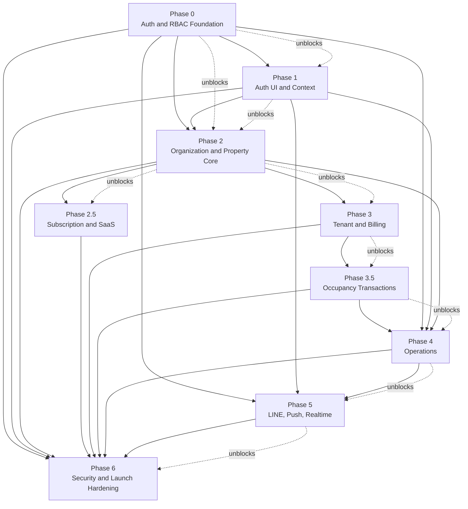

# 06 - Implementation Roadmap

## 1. Guiding Order

Implement the authorization model before building role dashboards. The old single-role model must not become the foundation for application code.

### 1.1 Phase Dependency Graph

Phases run in dependency order. Phase 3.5 (Occupancy Transactions) sits between Phase 3 (Tenant and Billing) and Phase 4 (Operations); operational `meter_readings` in Phase 4 are distinct from immutable `meter_snapshots` captured at handover.



| Phase | Depends on | Unblocks |
|---|---|---|
| 0 — Auth and RBAC Foundation | — | 1, 2, 4, 5, 6 |
| 1 — Auth UI and Context | 0 | 2, 4, 5, 6 |
| 2 — Organization and Property Core | 0, 1 | 2.5, 3, 4, 6 |
| 2.5 — Subscription and SaaS | 2 | 6 |
| 3 — Tenant and Billing | 2 | 3.5, 6 |
| 3.5 — Occupancy Transactions | 3 | 4, 6 |
| 4 — Operations | 0, 1, 2, 3.5 | 5, 6 |
| 5 — LINE, Push, Realtime | 0, 1, 4 | 6 |
| 6 — Security and Launch Hardening | all prior | launch |

### 1.2 Phase Roadmap

| Order | Phase | Scope summary |
|:---:|---|---|
| 0 | Auth and RBAC Foundation | Memberships, invitations, RLS helpers, `user_identities`, notification schema, `audit_logs`, `platform_admins`, archival tables |
| 1 | Auth UI and Context | Registration, invite/activation flows, membership switcher, middleware guard, in-app notifications |
| 2 | Organization and Property Core | Org settings, property/building/room CRUD, manager assignment, archival |
| 2.5 | Subscription and SaaS | Plans, org subscriptions, usage counters, feature gates, platform admin overrides |
| 3 | Tenant and Billing | Tenant activation, profiles, leases, billing periods, bills, tenant bill view |
| 3.5 | Occupancy Transactions | Move-in/move-out handover, inspection checklists, immutable meter snapshots, deposit settlement — see [03-database-schema.md](./03-database-schema.md) §4.9 and [04-rbac.md](./04-rbac.md) §3.1 |
| 4 | Operations | Maintenance tickets, housekeeping, operational meter readings, notifications, activity feed |
| 5 | LINE, Push, Realtime | LINE Messaging API, webhooks, push delivery, Rich Menu, LIFF |
| 6 | Security and Launch Hardening | Advisors, CI RLS suite, invitation expiry, membership deactivation audit, performance review |

## 2. Phase 0 — Auth and RBAC Foundation

**Architecture review migrations (20240109000000–20240109000010):** `user_identities` + `handle_new_user` email identity (REC-01); `notification_deliveries` (REC-02); `audit_logs` + `record_audit_event` + archive (REC-03); `platform_admins` + `organizations.suspended_at` (REC-04); archival pg_cron jobs (REC-05); buildings RLS fix (REC-06); tickets RLS fix (REC-07); org-level owner invitations (REC-09); `archived_at` columns (REC-13); subscription tables + `check_property_limit` (REC-14); activity feed views (§14).

Deliverables:

- Create `membership_role` and `invitation_status` enums.
- Create `memberships`, `invitations`, and `tenant_profiles`.
- Remove the design dependency on `profiles.role`, `organization_members`, `property_staff`, and `properties.manager_id`.
- Add indexes for membership lookups, invitation validation, and tenant room occupancy.
- Add partial unique indexes on memberships, org-consistency trigger, and last-owner deactivation guard.
- Denormalize `organization_id` onto `tenant_profiles`, `billing_periods`, `meter_readings`, and `housekeeping_tasks`.
- Add RLS helper functions around memberships; inline predicates in row-level policies (no `can_access_property` in `USING` clauses).
- Add `invitations_archive` and `notifications_archive` tables with `pg_cron` archival jobs.
- Mandate keyset pagination helpers for all list views.
- Add pgTAP tests for cross-organization and cross-property denial.
- Regenerate Supabase types after migrations.
- Create `platform_admins` table (outside `memberships`; keyed on `auth.users.id`, includes `granted_by`, `revoked_at`).
- Add `suspended_at timestamptz` to `organizations`.
- Add `is_platform_admin()` SECURITY DEFINER helper; exclude platform admins from org-scoped RLS policies — platform admin queries must run via service-role endpoints only.
- Create `audit_logs` table with `actor_id`, `organization_id`, `property_id`, `event_type`, `metadata jsonb`, `created_at`. Revoke UPDATE/DELETE grants at schema level — records are INSERT-only.
- Add composite indexes on `audit_logs(organization_id, created_at desc)` and `(property_id, created_at desc)`.
- **Migration**: `user_identities` table with RLS (provider-based identity; supports email, LINE, Google, Apple without schema changes).
- **Migration**: `notifications` and `notification_deliveries` tables — schema only; no delivery logic yet.
- **Architecture**: User Identity Layer documented in `02-system-architecture.md` §3.1.
- **Architecture**: Notification architecture documented in `02-system-architecture.md` §3.2.
- **Trigger**: `handle_new_user` inserts an `email` row into `user_identities` for every new registration.

Schema additions (Phase 0 migration):

```sql
create table public.platform_admins (
  id          uuid primary key default gen_random_uuid(),
  user_id     uuid not null unique references auth.users(id) on delete cascade,
  granted_by  uuid references auth.users(id) on delete set null,
  created_at  timestamptz not null default now(),
  revoked_at  timestamptz
);

alter table public.organizations
  add column suspended_at timestamptz;

create table public.audit_logs (
  id              uuid primary key default gen_random_uuid(),
  actor_id        uuid references auth.users(id) on delete set null,
  organization_id uuid references public.organizations(id) on delete set null,
  property_id     uuid references public.properties(id) on delete set null,
  event_type      text not null,
  metadata        jsonb not null default '{}',
  created_at      timestamptz not null default now()
);

create index idx_audit_logs_org_created      on public.audit_logs (organization_id, created_at desc);
create index idx_audit_logs_property_created on public.audit_logs (property_id, created_at desc);
create index idx_audit_logs_event_type       on public.audit_logs (event_type, created_at desc);

revoke update, delete on public.audit_logs from authenticated;
```

Backend:

- RLS helper functions (`is_org_owner`, `has_property_role`, `can_access_property`) and membership policies.
- `handle_new_user` trigger inserts `profiles` row and `user_identities` email row.
- `record_audit_event` SECURITY DEFINER helper for INSERT-only audit writes.
- Keyset pagination helpers for list views.

Frontend:

- None in this phase — schema and server-side foundation only.

Testing:

- pgTAP cross-organization and cross-property denial on membership-scoped tables.
- Owner signup integration test creates org, property, and owner membership atomically.
- Platform admin suspend flow produces `audit_logs` row.

Exit criteria:

- Owner signup creates organization, first property, and owner membership.
- Staff invitations create memberships only after acceptance.
- Tenant activation creates tenant membership and tenant profile.
- RLS denies access outside the user's memberships.
- Platform admin can view all organizations and suspend one without belonging to any membership.
- Critical business events produce an immutable `audit_logs` row.

## 3. Phase 1 — Auth UI and Context

Deliverables:

- Owner registration and onboarding screens.
- Invite acceptance and password setup screens.
- Tenant activation screens.
- Membership/property/role switcher.
- `habio-active-membership` signed cookie.
- Middleware route guard with `validateMembershipById` fast path (full membership list only on context switch).
- **LINE linking**: Account linking page at `/[role]/account/link-line` for all five roles (owner, manager, technician, housekeeper, tenant).
- **Server actions**: `linkLineIdentity` and `unlinkLineIdentity` in `src/lib/actions/identity.ts`.
- **UI**: Display LINE linked/unlinked status in account settings for all roles.
- **Notifications**: `in_app` channel activated — notifications inbox reads from `notifications` + `notification_deliveries`.

Database:

- No new tables — uses Phase 0 `memberships`, `invitations`, `user_identities`, `notifications`, `notification_deliveries`.

Backend:

- Middleware route guard with `validateMembershipById` fast path.
- Server Actions: `linkLineIdentity`, `unlinkLineIdentity` in `src/lib/actions/identity.ts`.
- Signed `habio-active-membership` cookie read/write helpers.

Frontend:

- Owner registration and onboarding; invite acceptance; tenant activation screens.
- Membership/property/role switcher at `/select-membership`.
- LINE linking page at `/[role]/account/link-line` for all five roles.
- In-app notification inbox at `/notifications`.

Testing:

- Multi-role context switch updates cookie and redirects to correct role dashboard.
- Wrong role route redirects to active role dashboard.
- Users with no memberships cannot access dashboards.

Exit criteria:

- Multi-role users can switch context.
- Wrong role route redirects to active role dashboard.
- Users with no memberships cannot access dashboards.
- Any role can link a LINE account after authentication; linking does not grant access without a membership.
- In-app notification inbox reads from `notifications` with per-channel delivery state in `notification_deliveries`.

## 4. Phase 2 — Organization and Property Core

Deliverables:

- Owner organization settings.
- Property CRUD.
- Building CRUD.
- Room CRUD and archive.
- Manager property assignment through memberships.
- Apply archival strategy (§12) to `properties`, `buildings`, and `rooms` — add `archived_at` columns; default RLS and list queries exclude `archived_at is not null` rows.

Database:

- `properties`, `buildings`, `rooms` tables with `archived_at` on applicable entities — see [03-database-schema.md](./03-database-schema.md) §4.3–§4.6.
- Manager assignment via property-scoped `memberships` rows.

Backend:

- Server Actions for org settings, property/building/room CRUD, and manager membership assignment.
- Archive mutations set `archived_at = now()` (owner or manager only).

Frontend:

- Owner org settings; property/building/room CRUD under `/owner/` and `/manager/properties/[propertyId]/` — see [05-folder-structure.md](./05-folder-structure.md).

Testing:

- pgTAP cross-property room access denial.
- Manager sees and modifies only assigned properties.

Exit criteria:

- Owners can manage all organization properties.
- Managers see and modify only assigned properties.
- Cross-property room access is denied by RLS.

## 5. Phase 2.5 — Subscription and SaaS Management

> **Authoritative schema:** [03-database-schema.md](./03-database-schema.md) §4.10. **RLS matrix:** [04-rbac.md](./04-rbac.md) §3.3. **Enforcement:** Server Actions and SECURITY DEFINER RPCs only — never in RLS.

### Hybrid pricing model

Plans differentiate on **scale** (org-wide property and room totals), not on core feature access. All operational features — Billing, Tenant Management, Move-In, Move-Out, Maintenance, Housekeeping, LINE Integration — are available on every plan. Future premium capabilities are gated via `subscription_plans.features` jsonb (see plan_features below).

### Plan limits (exact)

| Plan | `max_properties` | `max_rooms` | `features` |
|---|---:|---:|---|
| Free | 1 | 20 | `{}` |
| Starter | 3 | 50 | `{}` |
| Pro | 10 | 200 | `{}` |
| Enterprise | null (unlimited) | null (unlimited) | `{}` (+ future flags) |

`max_properties` and `max_rooms` are **org-wide totals** (not per-property). `null` = unlimited.

Deliverables:

- `subscription_plans` table — plan catalog with `max_properties`, `max_rooms`, and `features` jsonb.
- `organization_subscriptions` table — one row per organization linking to active plan and billing period.
- `usage_counters` table — point-in-time state counters; PK `(organization_id, metric)`; no `period_start`.
- `is_feature_enabled(org_id, feature_key)` SECURITY DEFINER helper for plan-based feature gates in Server Actions.
- `check_and_increment_usage(org_id, metric, max_limit)` SECURITY DEFINER helper — atomic limit check and counter increment.
- Server Actions enforce limits before property/room creation (Phase 2) and tenant activation (Phase 3).
- Sync `organizations.plan` denormalized cache when `organization_subscriptions.plan_id` changes.
- Platform admin service-role endpoints: view subscription status, override plan, suspend organization.
- Seed four plan rows and backfill `organization_subscriptions` + initial `usage_counters` for existing orgs.

Database (Phase 2.5 migration):

```sql
create table public.subscription_plans (
  id              uuid primary key default gen_random_uuid(),
  name            text not null unique,
  max_properties  integer,          -- null = unlimited
  max_rooms       integer,          -- null = unlimited (org-wide total)
  features        jsonb not null default '{}',
  created_at      timestamptz not null default now()
);

create table public.organization_subscriptions (
  id                    uuid primary key default gen_random_uuid(),
  organization_id       uuid not null unique references public.organizations(id) on delete cascade,
  plan_id               uuid not null references public.subscription_plans(id),
  status                text not null default 'active'
                        check (status in ('active', 'trialing', 'past_due', 'cancelled')),
  billing_cycle         text not null default 'monthly'
                        check (billing_cycle in ('monthly', 'annual')),
  current_period_start  date not null,
  current_period_end    date not null,
  trial_ends_at         timestamptz,
  cancelled_at          timestamptz,
  created_at            timestamptz not null default now(),
  updated_at            timestamptz not null default now()
);

create table public.usage_counters (
  organization_id  uuid not null references public.organizations(id) on delete cascade,
  metric           text not null
                   check (metric in ('active_properties', 'active_rooms', 'active_tenants')),
  count            integer not null default 0 check (count >= 0),
  updated_at       timestamptz not null default now(),
  primary key (organization_id, metric)
);

create index idx_organization_subscriptions_plan
  on public.organization_subscriptions (plan_id);
```

Seed data:

```sql
insert into public.subscription_plans (name, max_properties, max_rooms, features) values
  ('free',       1,    20,   '{}'),
  ('starter',    3,    50,   '{}'),
  ('pro',        10,   200,  '{}'),
  ('enterprise', null, null, '{}');
```

### `plan_features` architecture

Feature flags live in `subscription_plans.features` jsonb — no separate table. MVP seed uses empty `{}` on all plans (no flags enabled). Adding a premium feature updates the plan's JSON — no schema migration required.

| Feature key | Description | MVP value |
|---|---|---|
| `advanced_reports` | Advanced analytics and exports | false |
| `api_access` | REST/webhook API key management | false |
| `custom_branding` | Custom logo, colors, domain | false |
| `priority_support` | Dedicated support SLA | false |
| `multi_owner` | Multiple org-level owners | false |

Helper (Server Actions only, not RLS):

```sql
create or replace function public.is_feature_enabled(p_org_id uuid, p_feature_key text)
returns boolean
language sql stable security definer
set search_path = public
as $$
  select coalesce(
    (
      select (sp.features ->> p_feature_key)::boolean
      from public.organization_subscriptions os
      join public.subscription_plans sp on sp.id = os.plan_id
      where os.organization_id = p_org_id
        and os.status = 'active'
    ),
    false
  );
$$;
```

### Usage counter lifecycle

| Event | Counter | Direction | Phase |
|---|---|---|---|
| Property created | `active_properties` | +1 | 2 |
| Property archived | `active_properties` | −1 | 2 |
| Room created | `active_rooms` | +1 | 2 |
| Room archived | `active_rooms` | −1 | 2 |
| Tenant `lease_status` → `active` | `active_tenants` | +1 | 3 |
| Tenant `lease_status` → `terminated` | `active_tenants` | −1 | 3.5 |

`active_tenants` is tracked for analytics but has **no plan limit enforced in MVP**. Counter mutations use `INSERT … ON CONFLICT DO UPDATE … RETURNING`.

### Enforcement pattern

```typescript
// Pseudocode — before createProperty()
const ok = await checkAndIncrementUsage(orgId, 'active_properties', plan.max_properties);
if (!ok) throw new SubscriptionLimitError('property_limit_reached');
```

Rules:

- Enforcement in Server Actions and SECURITY DEFINER RPCs only — **never in RLS** ([04-rbac.md](./04-rbac.md) §6.3).
- Never enforce in client-side code alone.
- Combine limit check and counter increment in a single `UPDATE … WHERE count < max RETURNING` to prevent TOCTOU races.
- `organizations.plan` synced when `organization_subscriptions.plan_id` changes (trigger or Server Action).

Backend:

- `is_feature_enabled(p_org_id, p_feature_key)` — feature gate helper.
- `check_and_increment_usage(p_org_id, p_metric, p_max)` — atomic counter increment with limit guard.
- `decrement_usage(p_org_id, p_metric)` — counter decrement on archive/termination.
- Property and room Server Actions call `check_and_increment_usage` before insert; archive actions call `decrement_usage`.
- `sync_organization_plan(p_org_id)` — update `organizations.plan` from active subscription.
- Platform admin service-role endpoints for subscription overrides and org suspension.
- RLS policies per [04-rbac.md](./04-rbac.md) §6.2 — read-only for owners/managers on counters; no authenticated DML on `usage_counters`.

Frontend:

- Owner org settings: display current plan name (from `organizations.plan` cache) and usage summary (properties/rooms used vs limit).
- Upgrade prompt when limit reached — informational; enforcement is server-side.
- Platform admin UI: subscription status per organization, plan override, usage counters readout.

Testing:

- pgTAP: property creation blocked when `max_properties` limit reached.
- pgTAP: room creation blocked when `max_rooms` limit reached.
- pgTAP: concurrent creation attempts respect atomic counter guard.
- pgTAP: `is_feature_enabled` returns `false` for all keys on MVP seed plans.
- pgTAP: `usage_counters` has no authenticated `INSERT`/`UPDATE`/`DELETE` policies.
- Integration: new org signup creates `organization_subscriptions` row (free plan) and zeroed counter rows.

Exit criteria:

- Every organization has an `organization_subscriptions` row on the free plan.
- Four seed plan rows exist with exact limits (Free 1/20, Starter 3/50, Pro 10/200, Enterprise unlimited).
- Property creation is blocked when `max_properties` limit is reached.
- Room creation is blocked when `max_rooms` limit is reached.
- Plan limits are enforced in Server Actions only; RLS does not enforce plan limits.
- `organizations.plan` stays in sync with active subscription.
- Initial `usage_counters` rows seeded for each org (`active_properties`, `active_rooms`, `active_tenants` at 0 or backfilled from live counts).

## 6. Phase 3 — Tenant and Billing

Deliverables:

- Manager-created tenant activation.
- Tenant profile management.
- Lease lifecycle.
- Billing periods.
- Bills and bill line items.
- Tenant bill view.

Database:

- `tenant_profiles`, `billing_periods`, `bills`, bill line items — see [03-database-schema.md](./03-database-schema.md) §4.7 and operational tables §5.
- Partial unique index `tenant_profiles_one_active_per_room` enforces single active tenancy per room.
- `sync_room_on_lease_change` trigger on `tenant_profiles`.

Backend:

- Manager-driven tenant activation (invitation + membership + profile in one transaction).
- Bill generation and mark-paid Server Actions with `record_audit_event`.

Frontend:

- Tenant directory and detail under `/manager/properties/[propertyId]/tenants/`.
- Billing UI under `/manager/properties/[propertyId]/billing/`.
- Tenant bill view under `/tenant/billing/`.

Testing:

- Occupancy constraint prevents two active tenants in one room.
- Tenants see only their own room and bills.
- `tenant_created`, `tenant_updated`, `bill_created`, `bill_paid` audit events.

Exit criteria:

- Managers can manage tenants only in assigned properties.
- Tenants see only their own room and bills.
- Occupancy constraints prevent two active tenants in one room.
- `tenant_created`, `tenant_updated`, `bill_created`, and `bill_paid` events produce `audit_logs` rows.

## 7. Phase 3.5 — Occupancy Transactions

> **Phase dependency:** Requires Phase 3 (`tenant_profiles`, lease lifecycle, billing). Move-in and move-out workflows integrate with the existing `sync_room_on_lease_change` trigger on `tenant_profiles` that syncs room status from lease changes.
>
> **Authoritative schema:** [03-database-schema.md](./03-database-schema.md) §4.9. **RLS matrix:** [04-rbac.md](./04-rbac.md) §3.1. **Staff assignment pattern:** [04-rbac.md](./04-rbac.md) §3.2.

Deliverables:

- Move-in transactions — authoritative handover record with `status` lifecycle (`draft` → `completed` | `voided`), security deposit, advance rent, and denormalized meter start readings.
- Move-out transactions — authoritative return and settlement record with `status` lifecycle (`draft` → `settled` | `disputed` | `voided`), damage/cleaning/other deductions, computed `deposit_refund`, and denormalized meter end readings.
- Inspection items — checklist rows keyed to a parent transaction with `item_name`, `sort_order`, condition status, notes, and photo evidence.
- Meter snapshots — one immutable row per transaction with combined `electric_reading` and `water_reading`; INSERT-only (no UPDATE/DELETE grants).
- Deposit management — record deposit received at move-in completion; compute and store `deposit_refund` at move-out settlement.
- Settlement workflow — preview net refund (`deposit_refund`) before confirming move-out; support `disputed` status for contested settlements.
- Transaction history — property-scoped keyset-paginated lists with drill-down to inspection and meter detail.

Database:

- Enums (see [03-database-schema.md](./03-database-schema.md) §3): `move_in_transaction_status` (`draft`, `completed`, `voided`); `move_out_transaction_status` (`draft`, `settled`, `disputed`, `voided`); `inspection_item_status` (`good`, `damaged`, `missing`, `needs_repair`); `meter_snapshot_type` (`move_in`, `move_out`).
- `move_in_transactions` — `status`, `security_deposit`, `advance_rent`, `move_in_date`, denormalized `electric_meter_start` / `water_meter_start`, `created_by` (not null), scope columns; `unique (room_id, tenant_profile_id)`.
- `move_out_transactions` — `status`, `damage_charge`, `cleaning_fee`, `other_deductions`, `deposit_refund`, `settlement_notes`, `electric_meter_end` / `water_meter_end`, `created_by`, `settled_by`, `settled_at`, optional `move_in_transaction_id`; `unique (tenant_profile_id)`. No `settlement_total` column — net refund is `deposit_refund`.
- `inspection_items` — `item_name` (not `item_key`), `status`, `notes`, `photo_url`, `sort_order`, `created_by`; parent XOR constraint (move-in or move-out FK).
- `meter_snapshots` — combined `electric_reading` + `water_reading` on one row per transaction; `reading_date`, `submitted_by`, `photo_url`; unique partial indexes enforce one snapshot per parent transaction.
- Org-consistency triggers on all occupancy tables (same pattern as `validate_membership_org_consistency`).
- Indexes on `(organization_id, created_at desc)`, `(property_id, created_at desc)`, `(tenant_profile_id)`, `(room_id)`, and partial status indexes for draft/disputed lists.
- RLS policies per [04-rbac.md](./04-rbac.md) §6.2 — inline `is_org_owner(organization_id)` and `has_property_role(property_id, 'manager')`; tenant SELECT via `tenant_profiles.user_id = auth.uid()`. Technician/housekeeper SELECT deferred until `inspection_assignments` ships (§3.2).
- `REVOKE UPDATE, DELETE ON meter_snapshots FROM authenticated`.
- Hard deletes forbidden on transaction tables; void via `status = 'voided'`.

Schema reference (Phase 3.5 migration — full DDL in [03-database-schema.md](./03-database-schema.md) §4.9):

```sql
-- Enums: move_in_transaction_status, move_out_transaction_status,
--         inspection_item_status, meter_snapshot_type

-- Tables: move_in_transactions, move_out_transactions,
--         inspection_items, meter_snapshots
-- (see 03-database-schema.md §4.9.1–§4.9.4 for canonical DDL)

revoke update, delete on public.meter_snapshots from authenticated;

-- Atomic completion RPCs (SECURITY DEFINER; called from Server Actions only)
-- complete_move_in(...)
--   → inserts move_in_transactions (status = 'completed'), inspection_items, meter_snapshots;
--     denormalizes electric_meter_start / water_meter_start onto parent transaction;
--     sets tenant_profiles.lease_status = 'active' (fires sync_room_on_lease_change);
--     writes audit events: move_in_completed, deposit_received.
-- complete_move_out(...)  -- settles a draft move-out
--   → inserts or updates move_out_transactions (status = 'settled', settled_by, settled_at);
--     computes deposit_refund = security_deposit - damage_charge - cleaning_fee - other_deductions;
--     denormalizes electric_meter_end / water_meter_end onto parent transaction;
--     sets tenant_profiles.lease_status = 'terminated' (fires sync_room_on_lease_change);
--     writes audit events: move_out_completed, deposit_refunded.
```

Backend:

- `complete_move_in()` RPC — validate manager access, room availability, and tenant profile scope; persist transaction (`status = 'completed'`), inspection items, and meter snapshot atomically; set `created_by = auth.uid()`.
- `complete_move_out()` RPC — validate active tenancy, link to originating move-in when present, persist return records atomically; set `settled_by` and `settled_at` on settlement.
- Draft workflow — managers may create draft transactions and inspection rows before calling completion RPCs; drafts are editable; completion is irreversible except via `voided` status.
- Settlement calculation — compute `deposit_refund` from move-in `security_deposit` minus `damage_charge`, `cleaning_fee`, and `other_deductions`; clamp to `>= 0`; expose preview in Server Action before RPC call.
- Inspection recording — accept checklist payload (`item_name`, `status`, `notes`, `sort_order`) nested in completion RPCs.
- Photo evidence — upload inspection and meter photos to Supabase Storage; store `photo_url` on `inspection_items` and `meter_snapshots`; storage policies mirror property-scoped membership access.
- Audit logging — call shared `record_audit_event` inside completion RPCs for `move_in_completed`, `move_out_completed`, `deposit_received`, and `deposit_refunded`.
- Dispute handling — managers may set `status = 'disputed'` on move-out before re-settlement; product rules for dispute resolution are an open gap (see §17).

Frontend:

- Manager routes (planned — not yet in [05-folder-structure.md](./05-folder-structure.md)):
  - `/manager/properties/[propertyId]/occupancy/` — transaction history list
  - `/manager/properties/[propertyId]/occupancy/move-in/new` — move-in wizard
  - `/manager/properties/[propertyId]/occupancy/move-in/[transactionId]` — move-in detail
  - `/manager/properties/[propertyId]/occupancy/move-out/new` — move-out wizard
  - `/manager/properties/[propertyId]/occupancy/move-out/[transactionId]` — move-out detail and settlement preview
- Tenant routes (planned):
  - `/tenant/occupancy/` — read-only view of own move-in and move-out records
- Move-in wizard — tenant/room selection, deposit and advance rent, inspection checklist, combined electric/water start readings, photo uploads.
- Move-out wizard — damage, cleaning, and other deductions, inspection checklist, combined electric/water end readings, settlement preview before confirm.
- Inspection checklist component — reusable for move-in and move-out with `good` / `damaged` / `missing` / `needs_repair` status and per-item notes.
- Deposit summary — display deposit received at move-in and applied/withheld amounts at move-out.
- Server Actions in `src/lib/actions/occupancy.ts`; queries in `src/lib/queries/occupancy.ts`; components under `src/components/occupancy/`.

Testing:

- Move-in creates occupancy — `complete_move_in()` sets `tenant_profiles.lease_status = 'active'` and room status becomes `occupied` via `sync_room_on_lease_change`.
- Move-out releases room — `complete_move_out()` sets `tenant_profiles.lease_status = 'terminated'` and room status becomes `available`.
- Deposit calculations — pgTAP asserts `deposit_refund` for representative charge scenarios (including `other_deductions`).
- Meter snapshot immutability — UPDATE and DELETE on `meter_snapshots` fail for authenticated sessions.
- Status lifecycle — pgTAP asserts draft transactions are editable, completed/settled transactions reject direct UPDATE of monetary fields, voided transactions are read-only.
- Audit rows — pgTAP asserts `audit_logs` rows exist after each completion RPC with correct `event_type` and metadata.
- Cross-property denial — pgTAP asserts managers cannot read or complete transactions outside assigned properties.
- Denormalized meter columns — pgTAP asserts `electric_meter_start` / `water_meter_start` (and end equivalents) match linked `meter_snapshots` after completion.

Exit criteria:

- Managers can perform complete move-in and move-out workflows end to end from the dashboard.
- Settlement preview shows correct `deposit_refund` before move-out confirmation.
- Room status changes automatically through the existing `tenant_profiles` lease-status trigger.
- All move-in, move-out, and deposit actions produce immutable `audit_logs` rows in the same transaction.
- Schema, RLS, and RPC behavior match [03-database-schema.md](./03-database-schema.md) §4.9 and [04-rbac.md](./04-rbac.md) §3.1 exactly.

## 8. Phase 4 — Operations

> **Phase dependency:** Requires Phase 3.5 occupancy transactions for complete move-in/move-out history. Operational `meter_readings` in this phase are distinct from immutable `meter_snapshots` captured at tenancy handover — see [03-database-schema.md](./03-database-schema.md) §4.9 vs §5.

Deliverables:

- Maintenance tickets and comments.
- Technician assignment and status updates.
- Housekeeping tasks.
- Meter readings and manager approval (recurring operational readings; not tenancy handover snapshots).
- Notifications.

Database:

- `maintenance_tickets`, `housekeeping_tasks`, `meter_readings`, `billing_periods` — see [03-database-schema.md](./03-database-schema.md) §5.
- Activity feed views over `audit_logs` (§14).
- Optional: `inspection_assignments` table if staff handover access ships in this phase — see [04-rbac.md](./04-rbac.md) §3.2.

Backend:

- Ticket assignment, housekeeping task assignment, meter reading submit/approve flows.
- Notification creation on operational events (in-app channel).

Frontend:

- Maintenance, housekeeping, and meter-reading routes per [05-folder-structure.md](./05-folder-structure.md).
- Property-scoped activity feed widget on owner/manager dashboards.

Testing:

- Technicians see only assigned jobs; housekeepers see only assigned tasks and scoped meter readings.
- Activity feed queries use keyset pagination on `(created_at, id)`.

Exit criteria:

- Technicians see only assigned jobs.
- Housekeepers see only assigned tasks and scoped meter readings.
- Owners and managers have property-scoped operational dashboards.
- `maintenance_ticket_created`, `maintenance_ticket_closed`, `membership_added`, and `membership_removed` events produce `audit_logs` rows.
- Activity feed queries against `audit_logs` are indexed and performant at property scope.

## 9. Phase 5 — LINE Messaging, Push Notifications, and Realtime

> **Schema dependency:** The `user_identities` and `notification_deliveries` tables required by Phase 5 are already in place from Phase 0. LINE Messaging API, webhooks, push notification delivery, Rich Menu, and LIFF are deferred to this phase.

Deliverables:

- LINE Messaging API integration.
- LINE push notifications (writes `notification_deliveries` rows with `channel = 'line'`).
- LINE webhook processing with HMAC-SHA256 signature validation.
- Realtime notification channels.
- Ticket attachment storage policies.
- Rich Menu and LIFF (mobile task views for staff and tenants).

Database:

- No new core tables — uses `user_identities`, `notifications`, `notification_deliveries` from Phase 0.

Backend:

- LINE webhook Route Handler with HMAC-SHA256 validation.
- Push delivery writes `notification_deliveries` rows with `channel = 'line'`.
- Realtime channel subscriptions scoped to `user_id` or property membership.

Frontend:

- Rich Menu and LIFF mobile views for staff and tenants.

Testing:

- LINE webhook rejects invalid signatures.
- Notification insert succeeds even when LINE push fails (in-app fallback).

Exit criteria:

- Storage and Realtime policies mirror membership-based access.
- LINE webhook uses server-side validation and service-role writes only where needed.

## 10. Phase 6 — Security and Launch Hardening

Deliverables:

- Supabase advisors clean or documented.
- RLS test suite in CI.
- Invitation expiry job (pending to expired).
- Membership deactivation workflows (respect last-owner guard).
- Audit review of `SECURITY DEFINER` functions and execute grants.
- Performance review of membership helper indexes.

Database:

- `audit_logs_archive` table and weekly `pg_cron` archival job (rows older than 180 days).
- Invitation expiry job (pending → expired).

Backend:

- Audit of all `SECURITY DEFINER` functions and execute grants.
- Org-level activity feed widget (extends property-scoped feed from Phase 4).

Frontend:

- None required beyond hardening existing dashboards.

Testing:

- Full RLS test suite in CI (cross-org, cross-property, multi-role, occupancy, meter snapshot immutability).
- Multi-role user journey end-to-end tests.

Exit criteria:

- No known cross-organization data paths.
- No client-side service role exposure.
- Multi-role user journeys are covered by tests.

## 11. Pagination Standard

All list views use keyset (cursor-based) pagination. Offset pagination is not permitted on operational tables.

```sql
-- Example: bills list for a property
select *
from public.bills
where property_id = $1
  and (created_at, id) < ($cursor_created_at, $cursor_id)
order by created_at desc, id desc
limit 20;
```

Application helpers should accept an opaque cursor encoding `(created_at, id)` and return `next_cursor` in the response.

## 12. Soft Delete and Archival Strategy

Use `archived_at` for business records that must remain queryable for history, reporting, or audit trail. Use `deleted_at` only when the row must be logically invisible but cannot be hard-deleted (e.g., a user who has audit associations). Never hard-delete operational data.

Rules:

- `archived_at`: set when an entity is retired from active use. Default RLS and list queries add `WHERE archived_at IS NULL`. The record remains readable by owners, managers, and platform admins.
- `deleted_at`: reserved for compliance-only soft deletion. Not used in v1.
- Hard deletes are forbidden on: properties, buildings, rooms, bills, maintenance_tickets, housekeeping_tasks, tenant_profiles, memberships, move_in_transactions, move_out_transactions.

Tables requiring `archived_at` (add in Phase 0 or Phase 2 as applicable):

- properties
- buildings
- rooms (already present)
- bills
- maintenance_tickets
- housekeeping_tasks
- tenant_profiles (already present)

RLS and query pattern:

- Every list policy and application query must filter `WHERE archived_at IS NULL`.
- Archive actions are owner- or manager-only mutations setting `archived_at = now()`.
- Archival is not reversible without an explicit unarchive action (owner-only).

## 13. Audit Logging Standard

`audit_logs` is INSERT-only. UPDATE and DELETE grants are revoked at schema level.

Tracked event types (minimum MVP set):

- tenant_created
- tenant_updated
- bill_created
- bill_paid
- move_in_completed
- move_out_completed
- deposit_received
- deposit_refunded
- maintenance_ticket_created
- maintenance_ticket_closed
- housekeeping_task_completed
- meter_reading_approved
- membership_added
- membership_removed
- property_archived
- organization_suspended

Each row must include:

- `actor_id`: auth.users.id of the performing user (null for system jobs)
- `organization_id`: scoping org (required for all non-platform events)
- `property_id`: scoping property (nullable for org-level events)
- `event_type`: one of the tracked event types above
- `metadata`: jsonb snapshot of relevant identifiers and before/after values

RLS:

- Owners can SELECT `audit_logs` WHERE `organization_id` matches their membership.
- Managers can SELECT `audit_logs` WHERE `property_id` matches their membership.
- Platform admins can SELECT all rows via service-role endpoint.
- No authenticated role may UPDATE or DELETE `audit_logs`.

Exit criteria:

- Critical business actions produce audit rows in the same transaction.
- Audit records are queryable by organization and property with index-only scans.
- No UPDATE or DELETE on `audit_logs` succeeds from any authenticated session.

## 14. Activity Feed Foundation

Activity feeds are read views over `audit_logs`. Do not create a separate `activity_events` table; derive feeds from `audit_logs` using indexed queries.

Suggested views (implemented in Phase 4 or Phase 2.5):

```sql
create view public.organization_activity_feed as
  select id, actor_id, organization_id, property_id, event_type, metadata, created_at
  from public.audit_logs
  where organization_id is not null
  order by created_at desc;

create view public.property_activity_feed as
  select id, actor_id, organization_id, property_id, event_type, metadata, created_at
  from public.audit_logs
  where property_id is not null
  order by created_at desc;
```

Application queries paginate via keyset on `(created_at, id)` — see §11.

Feed event display examples:

- tenant_activated → "Tenant [name] activated in Room [number]"
- bill_paid → "Bill [amount] paid by [tenant]"
- move_in_completed → "Move-in completed for [tenant] in Room [number]"
- move_out_completed → "Move-out completed for [tenant] in Room [number]; deposit refund [amount]"
- deposit_received → "Security deposit [amount] received for Room [number]"
- deposit_refunded → "Deposit refund [amount] issued for Room [number]"
- ticket_assigned → "Ticket #[id] assigned to [technician]"
- ticket_closed → "Ticket #[id] closed"
- meter_approved → "Meter reading for Room [number] approved"

Dashboard integration: owner and manager dashboards include a property-scoped activity feed widget in Phase 4. Org-level feed added in Phase 6.

## 15. Migration Checklist

| Step | Action |
|---|---|
| 1 | Add new enums and tables additively. |
| 2 | Backfill legacy org owners, property managers, staff, and tenants into memberships. |
| 3 | Create tenant profiles from legacy tenants. |
| 4 | Add partial unique indexes, org-consistency and last-owner triggers, `organization_id` denormalization, and archival tables. |
| 5 | Replace old RLS helpers and policies. |
| 6 | Regenerate TypeScript database types. |
| 7 | Update seed data and pgTAP tests. |
| 8 | Drop legacy role and access columns/tables after verification. |
| 9 | Create `platform_admins`, add `organizations.suspended_at`, create `audit_logs` with revoked UPDATE/DELETE grants. |
| 10 | Create `subscription_plans`, `organization_subscriptions`, `usage_counters` per [03-database-schema.md](./03-database-schema.md) §4.10; seed four plan rows (Free 1/20, Starter 3/50, Pro 10/200, Enterprise unlimited); add `is_feature_enabled()` and `check_and_increment_usage()` helpers; RLS per [04-rbac.md](./04-rbac.md) §6.2; backfill `organization_subscriptions` (free plan) and initial `usage_counters` rows for all orgs. |
| 11 | Backfill `organization_subscriptions` for all existing organizations (assign free plan). |
| 12 | Add `archived_at` to `properties`, `buildings`, `bills`, `maintenance_tickets`, `housekeeping_tasks`; update RLS policies and list queries. |
| 13 | Create `organization_activity_feed` and `property_activity_feed` views. |
| 14 | Create occupancy enums (`move_in_transaction_status`, `move_out_transaction_status`, `inspection_item_status`, `meter_snapshot_type`); create `move_in_transactions`, `move_out_transactions`, `inspection_items`, `meter_snapshots` per [03-database-schema.md](./03-database-schema.md) §4.9; add org-consistency triggers, indexes, RLS policies per [04-rbac.md](./04-rbac.md) §6.2; add `complete_move_in` / `complete_move_out` RPCs; revoke UPDATE/DELETE on `meter_snapshots`. |
| 15 | (Optional, Phase 4) Create `inspection_assignments` and `is_assigned_to_inspection()` helper; extend occupancy RLS SELECT policies for technician/housekeeper per [04-rbac.md](./04-rbac.md) §3.2. |

## 16. Consistency Verification

Cross-reference of occupancy transaction and related architecture across docs. Status reflects state after this roadmap update.

| Area | Architecture (02) | ERD (03) | RLS (04) | Implementation Plan (06) | Status |
|---|---|---|---|---|---|
| Occupancy tables exist in ERD | — | `move_in_transactions`, `move_out_transactions`, `inspection_items`, `meter_snapshots` | Referenced in §3.1 matrix | Phase 3.5 deliverables | Aligned |
| Move-in status enum | — | `draft`, `completed`, `voided` | §3.1 (void via status) | Phase 3.5 database | Aligned (was `completed_by` only — fixed) |
| Move-out status enum | — | `draft`, `settled`, `disputed`, `voided` | §3.1 | Phase 3.5 database | Aligned (was no status — fixed) |
| `created_by` / `settled_by` | — | `created_by` NOT NULL; `settled_by`, `settled_at` on move-out | Footnotes §3.1 | Phase 3.5 backend | Aligned (was `completed_by` — fixed) |
| Inspection `item_name` | — | `item_name` (not `item_key`) | §3.1 | Phase 3.5 database | Aligned (was `item_key` — fixed) |
| Inspection status enum | — | `good`, `damaged`, `missing`, `needs_repair` | §3.1 | Phase 3.5 database | Aligned (was `pass/fail/na/pending` — fixed) |
| Combined meter readings | — | `electric_reading` + `water_reading` on one `meter_snapshots` row | §3.1 | Phase 3.5 database | Aligned (was per-meter rows — fixed) |
| Denormalized meter on transactions | — | `electric_meter_start/end`, `water_meter_start/end` | — | Phase 3.5 database | Aligned (was absent — fixed) |
| `settlement_total` column | — | Not in schema; `deposit_refund` only | — | Phase 3.5 database | Aligned (was present in 06 — fixed) |
| `other_deductions`, `settlement_notes` | — | Present on `move_out_transactions` | — | Phase 3.5 database | Aligned (was absent — fixed) |
| Meter snapshot immutability | — | `REVOKE UPDATE, DELETE` | §3.1, §6.2 | Phase 3.5 database + testing | Aligned |
| `inspection_assignments` | — | Not in ERD | Planned §3.2 | Deferred to Phase 4 (optional) | Documented gap |
| Technician/housekeeper occupancy read | — | — | Conditional §3.1 †, §3.2 | Not in Phase 3.5 MVP | Documented gap |
| RPC `complete_move_in` / `complete_move_out` | §7 Server Action rules (04) | §4.9.5 | §7 | Phase 3.5 backend | Aligned |
| Phase 3.5 position in dependency graph | — | §8 migration table | — | §1.1 graph | Aligned (graph regenerated) |
| Operational vs handover meters | §8 Realtime (meter_readings) | §4.9 vs §5 | `meter_readings` §6.2 | Phase 4 dependency note | Aligned |
| Occupancy frontend routes | — | — | Route guard §5 | Planned paths in Phase 3.5 | Gap — routes not in 05 |
| Requirements doc (01) | Legacy `profiles.role` model | Membership model | Membership model | Membership model | **Stale** — 01 not updated (out of scope) |
| ADR-001 in 07 | `profiles.role` | Memberships | Memberships | Memberships | **Stale** — superseded by membership model |
| `subscription_plans` DDL | — | §4.10 | RLS §6.2 | Phase 2.5 | Aligned |
| `max_rooms` (not per-property) | — | §4.10 | — | Phase 2.5 | Aligned |
| `usage_counters` no `period_start` | — | §4.10 | RLS §6.2 | Phase 2.5 | Aligned |
| `plan_features` / `is_feature_enabled()` | §4.10.4 | — | Phase 2.5 | Aligned |
| Enforcement in Server Actions only | — | §4.10.5 | §6.3 | Phase 2.5 backend | Aligned |
| Move-in/out decrement `active_tenants` | §4.9.5, §4.10.3 | — | Phase 3 + 3.5 | Aligned |
| Org-level `suspended_at` (Platform Admin) | §4.2 | Existing | Phase 0 | Existing — no change |

### Resolved mismatches (this update)

1. Phase 3.5 schema block replaced with reference to [03-database-schema.md](./03-database-schema.md) §4.9 and corrected field names, enums, and status lifecycles.
2. Removed `occupancy_transaction_type`, `item_key`, `settlement_total`, per-meter `meter_type`/`reading_value` rows, and `completed_by` from the implementation plan.
3. Added `created_by`, `settled_by`, `settled_at`, `other_deductions`, `settlement_notes`, combined meter columns, and status enums to Phase 3.5.
4. Regenerated phase dependency graph with Phase 3.5 between Phase 3 and Phase 4.
5. Migration checklist step 14 updated to reference canonical enums and cross-doc links.
6. Phase 2.5 rewritten with hybrid scale-based pricing, exact plan limits, `max_rooms` (org-wide), `usage_counters` without `period_start`, `plan_features` jsonb architecture, seed data, counter lifecycle, and enforcement rules aligned across 03/04/06.

## 17. Pre-Implementation Gaps

Items that block or constrain Phase 3.5 implementation start. Product decisions marked **decision needed**.

### Schema and migrations

| Gap | Detail | Blocking? |
|---|---|---|
| `inspection_assignments` not in ERD | Planned in [04-rbac.md](./04-rbac.md) §3.2 for technician/housekeeper conditional read; not in [03-database-schema.md](./03-database-schema.md) ERD or §4.9 | No — MVP uses manager-only inspection; defer to Phase 4 |
| RPC signatures undocumented in schema | `complete_move_in` / `complete_move_out` parameter lists and return types not in §4.9.5 | Yes — define before migration |
| Draft save RPCs | ERD implies draft status but no `save_move_in_draft` / `save_move_out_draft` RPC specified | Partial — need decision: direct INSERT for drafts vs dedicated RPC |
| Org-consistency trigger names | §4.9.5 references pattern but trigger function names not listed | Yes — name triggers in migration plan |
| Dispute workflow | `disputed` status exists; no RPC or UI flow for resolution → re-settlement | **Decision needed** |
| Void workflow | `voided` status documented; void RPC and who may void not specified | **Decision needed** |

### RLS and permissions

| Gap | Detail | Blocking? |
|---|---|---|
| Technician/housekeeper SELECT policies | Commented placeholders in [04-rbac.md](./04-rbac.md) §6.2; require `inspection_assignments` | No for MVP |
| `is_assigned_to_inspection()` helper | Body is `...` placeholder in §3.2 | Yes when assignments ship |
| Inspection item DELETE for managers | Matrix grants DELETE; void-via-status may be preferred | **Decision needed** |

### Frontend and folder structure

| Gap | Detail | Blocking? |
|---|---|---|
| Occupancy routes absent from 05 | [05-folder-structure.md](./05-folder-structure.md) has no `/occupancy/` tree | Yes — add to 05 before UI work |
| Owner occupancy routes | Owners have CRUD in RLS matrix; no owner route plan | **Decision needed** — owner uses org-wide view or manager paths? |
| Storage bucket for inspection photos | Referenced in Phase 3.5; bucket name and policies not in docs | Yes — define bucket + RLS mirror pattern |
| Default inspection checklist template | `item_name` values not specified (e.g. bed, AC, bathroom) | **Decision needed** — org default vs property default |

### RPCs and backend

| Gap | Detail | Blocking? |
|---|---|---|
| Outstanding balance in settlement | Old roadmap included outstanding bills in settlement; ERD has no column or RPC input for this | **Decision needed** — include in `deposit_refund` calc or separate? |
| Link move-in at move-out | `move_in_transaction_id` optional; auto-link logic not specified | Yes — define lookup (by `tenant_profile_id`) |
| Advance rent handling | `advance_rent` on move-in; no bill generation linkage documented | **Decision needed** |
| Audit metadata shape | Event types listed in §13; `metadata` jsonb keys for occupancy events not specified | Yes — define before RPC implementation |

### Testing

| Gap | Detail | Blocking? |
|---|---|---|
| pgTAP occupancy test file | No `occupancy_transactions.test.sql` in [05-folder-structure.md](./05-folder-structure.md) supabase/tests listing | Yes — add test file to migration checklist |
| Dispute and void status tests | Scenarios not defined | No for MVP if dispute/void deferred |

### Migration ordering

| Gap | Detail | Blocking? |
|---|---|---|
| Phase 3.5 after Phase 3 | Correct in §1.1 and §15 step 14 | Aligned |
| Enums before tables | Standard additive order | Aligned |
| RLS after tables + helpers | `is_org_owner` / `has_property_role` from Phase 0 | Aligned |
| `inspection_assignments` after occupancy tables | Step 15 optional in Phase 4 | Aligned |

### Stale docs (non-blocking for Phase 3.5)

- [01-requirements.md](./01-requirements.md) still references `profiles.role`, `organization_members`, `properties.manager_id`.
- [07-risks-and-decisions.md](./07-risks-and-decisions.md) ADR-001 describes `profiles.role` — superseded by membership model in 02/03/04/06.
- [05-folder-structure.md](./05-folder-structure.md) manager tree still shows legacy org/member paths from pre-membership model.

## 18. Major Risks

- RLS recursion around `memberships` if policies read the same table directly.
- Multi-role UX confusion if the active context is hidden.
- Partial tenant activation if membership, tenant profile, and room update are not transactional.
- Invitation token leakage through logs.
- Performance regressions if membership and property foreign keys are not indexed.
- Offset pagination on large operational tables (`bills`, `maintenance_tickets`, `notifications`).
- Unbounded `invitations` and `notifications` table growth without archival.
- Middleware loading all memberships per request for users with many property assignments.
- Subscription limit bypass: Server Action usage check and counter increment are not atomic; a concurrent property creation can pass the limit check before the counter is updated. Mitigation: use `SELECT … FOR UPDATE` on `usage_counters` or increment in a single `UPDATE … RETURNING` with a limit guard.
- Missing audit trail for critical actions: a Server Action that mutates data without writing to `audit_logs` in the same transaction loses the record permanently. Mitigation: shared `recordAuditEvent(tx, event)` helper called inside every mutating transaction; pgTAP test asserts audit row exists after key actions.
- Platform admin privilege escalation: if `platform_admins` is readable or writable by authenticated sessions, a user could grant themselves admin access. Mitigation: `platform_admins` table has no RLS SELECT/INSERT policy for authenticated; all reads and writes use service-role only.
- Excessive audit log growth: at 100,000 tenants generating ~20 auditable events per month, `audit_logs` accumulates ~2M rows/month. Mitigation: add `audit_logs_archive` table and weekly `pg_cron` job archiving rows older than 180 days; retain indexes on the live table for recent queries only.
- Activity feed query performance: `organization_activity_feed` view without a covering index degrades under high event volume. Mitigation: enforce keyset pagination; add partial index on `(organization_id, created_at desc)` and `(property_id, created_at desc)` in Phase 0; benchmark at 1M rows before Phase 4 dashboard integration.
