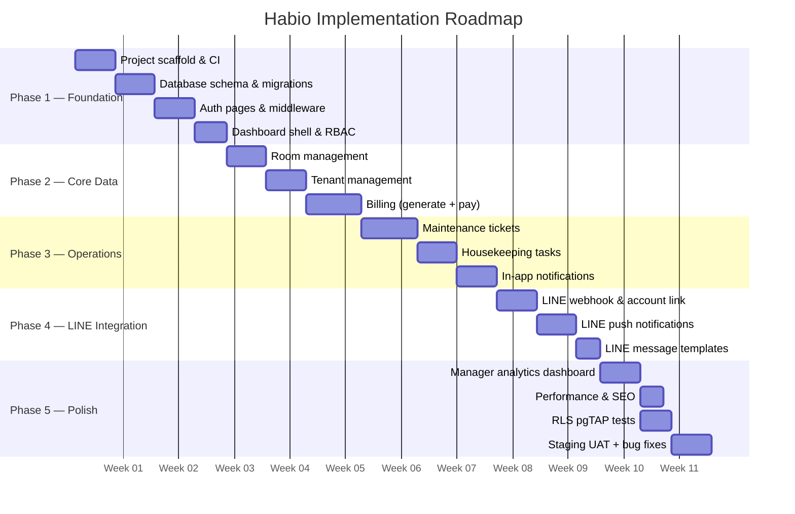
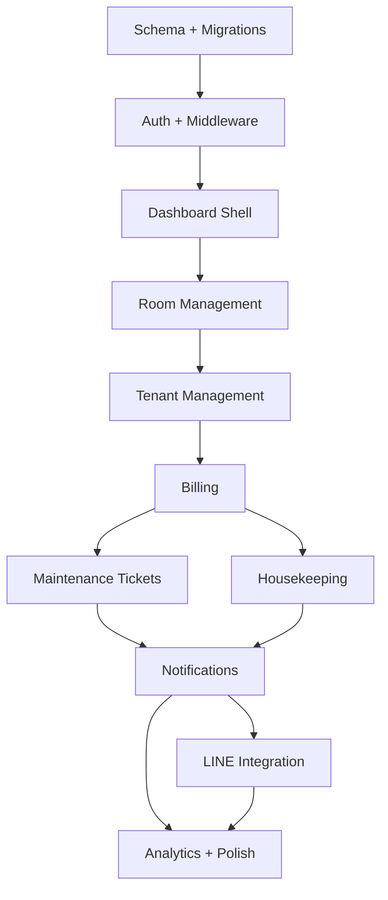

# 06 — Implementation Roadmap

## Overview

The roadmap is divided into five phases. Each phase builds on the previous one and produces a shippable increment. The goal is to reach a working end-to-end MVP (all four roles, core feature set) by end of Phase 3.

---

## Phase 1 — Foundation

**Goal**: A working, deployed skeleton with authentication, role routing, and an empty dashboard shell.

**Duration**: ~3 weeks

### Deliverables

| # | Task | Files / Outputs |
|---|---|---|
| 1.1 | Initialise Supabase CLI workspace | `supabase/config.toml` |
| 1.2 | Write initial schema migration | `supabase/migrations/..._initial_schema.sql` — includes `property_staff` table, all indexes, and partial unique indexes |
| 1.3 | Write RLS policies migration | `supabase/migrations/..._rls_policies.sql` |
| 1.4 | Write triggers migration | `supabase/migrations/..._triggers.sql` — includes `pg_cron` jobs for overdue bills and notification archival |
| 1.5 | Generate TypeScript types | `src/types/database.ts` |
| 1.6 | Wire root `src/middleware.ts` | Auth guard + role redirect live |
| 1.7 | Build `/auth/login` page | `src/app/(auth)/auth/login/page.tsx` |
| 1.8 | Build `/auth/forgot-password` page | `src/app/(auth)/auth/forgot-password/page.tsx` |
| 1.9 | Build `/auth/callback` route handler | `src/app/(auth)/auth/callback/route.ts` |
| 1.10 | Build dashboard layout shell | `src/app/(dashboard)/layout.tsx`, `Sidebar`, `Topnav` |
| 1.11 | Build empty dashboard pages per role | `/manager/dashboard`, `/tenant/dashboard`, `/technician/dashboard`, `/housekeeper/dashboard` |
| 1.12 | Set up `.env.example` and Vercel project | Deployment pipeline verified |
| 1.13 | Set up CI (GitHub Actions) | `supabase db push` + `next build` on every PR |

### Exit Criteria

- User can sign in, is redirected to their role's dashboard, and cannot access other roles' routes
- Database schema deployed to dev Supabase project with all RLS policies active
- Vercel preview deployment green on every PR

---

## Phase 2 — Core Data

**Goal**: Managers can set up their property — add rooms, onboard tenants, and generate bills.

**Duration**: ~3 weeks

### Deliverables

| # | Task | Files / Outputs |
|---|---|---|
| 2.1 | Room list page (manager) | `/manager/rooms/page.tsx` |
| 2.2 | Create/edit room form | `RoomForm`, `createRoom` action, `updateRoom` action |
| 2.3 | Room detail page | `/manager/rooms/[roomId]/page.tsx` |
| 2.4 | Archive room (soft delete) | `archiveRoom` action |
| 2.5 | Tenant directory page | `/manager/tenants/page.tsx` |
| 2.6 | Invite/create tenant form | `TenantForm`, `createTenant` action |
| 2.6a | Staff management (add/remove technicians & housekeepers) | `addPropertyStaff` action, `removePropertyStaff` action — writes to `property_staff` table |
| 2.7 | Tenant detail page | `/manager/tenants/[tenantId]/page.tsx` |
| 2.8 | Lease status management | `updateTenant` action — status transitions |
| 2.9 | Tenant's own room/lease view | `/tenant/room/page.tsx` |
| 2.10 | Bill generation form | `BillForm` + `LineItemRow`, `createBill` action |
| 2.11 | Bill detail + line items (manager) | `/manager/billing/[billId]/page.tsx` |
| 2.12 | Mark bill as paid | `markBillPaid` action |
| 2.13 | Tenant bill list + detail | `/tenant/billing/page.tsx`, `/tenant/billing/[billId]/page.tsx` |
| 2.14 | Overdue bill detection | Scheduled check or query at page load; status set to `overdue` |

### Exit Criteria

- Manager can CRUD rooms, invite a tenant, generate a bill, and mark it paid
- Tenant can view their room details, lease dates, and billing history
- RLS verified: tenant A cannot see tenant B's bills

---

## Phase 3 — Operations

**Goal**: Maintenance tickets and housekeeping tasks are fully functional. All roles have their core workflows. In-app notifications are live.

**Duration**: ~3 weeks

### Deliverables

| # | Task | Files / Outputs |
|---|---|---|
| 3.1 | Ticket list (manager) with filters | `/manager/maintenance/page.tsx` |
| 3.2 | Ticket detail + assignment (manager) | `/manager/maintenance/[ticketId]/page.tsx`, `assignTicket` action |
| 3.3 | Submit ticket form (tenant) + photo upload | `TicketForm`, `createTicket` action, Supabase Storage signed upload |
| 3.4 | Tenant ticket list + detail | `/tenant/maintenance/page.tsx`, `[ticketId]/page.tsx` |
| 3.5 | Technician ticket list + detail | `/technician/tickets/page.tsx`, `[ticketId]/page.tsx` |
| 3.6 | Update ticket status (technician) | `updateTicket` action |
| 3.7 | Comment thread (all ticket participants) | `TicketComments` component, `addComment` action |
| 3.8 | Housekeeping task creation + assignment (manager) | `TaskForm`, `createTask` action, `assignTask` action |
| 3.9 | Task list (manager) | `/manager/housekeeping/page.tsx` |
| 3.10 | Housekeeper task list + detail | `/housekeeper/tasks/page.tsx`, `[taskId]/page.tsx` |
| 3.11 | Mark task complete with notes (housekeeper) | `completeTask` action |
| 3.12 | Notification insert logic in all Server Actions | Notifications inserted after each meaningful event |
| 3.13 | Notification bell (realtime) | `NotificationBell`, `useRealtimeNotifications` hook |
| 3.14 | Full notification inbox page | `/notifications/page.tsx` |
| 3.15 | Mark read / mark all read | `markRead`, `markAllRead` actions |

### Exit Criteria

- Full ticket lifecycle works end-to-end (tenant creates → manager assigns → technician resolves)
- Full housekeeping lifecycle works (manager creates → housekeeper completes)
- In-app notifications arrive in real-time; badge count updates without page refresh
- All four role dashboards are functional with accurate summary data

---

## Phase 4 — LINE Integration

**Goal**: Users connected to LINE receive push notifications mirroring in-app events. Tenants can link their LINE account.

**Duration**: ~2 weeks

### Deliverables

| # | Task | Files / Outputs |
|---|---|---|
| 4.1 | LINE SDK wrapper | `src/lib/line/client.ts` |
| 4.2 | LINE webhook route handler | `src/app/api/webhooks/line/route.ts` |
| 4.3 | HMAC signature validation | `validateSignature()` in `src/lib/line/client.ts` |
| 4.4 | `follow` event handler — link LINE account | Upsert `line_connections` |
| 4.5 | `unfollow` event handler — deactivate connection | Set `is_active = false` |
| 4.6 | LINE push after notification insert | `src/lib/actions/notifications.ts` — call `pushMessage()` if connection exists |
| 4.7 | Flex message templates | `src/lib/line/messages.ts` — bill, ticket, task templates |
| 4.8 | LINE connection status in profile settings | Show connected/disconnected status |
| 4.9 | Test LINE integration in staging | All notification types verified in LINE app |

### Exit Criteria

- Following the LINE Official Account links the user's account
- Unfollowing deactivates the connection without error
- All in-app notification types trigger a matching LINE push message
- Webhook passes HMAC validation; invalid signatures are rejected with 401

---

## Phase 5 — Polish

**Goal**: Production-ready quality — analytics, performance, test coverage, and UAT sign-off.

**Duration**: ~2–3 weeks

### Deliverables

| # | Task | Files / Outputs |
|---|---|---|
| 5.1 | Manager analytics dashboard | Occupancy rate, revenue summary, ticket resolution time, task completion rate |
| 5.2 | Overdue bill cron job | `pg_cron` job `flip-overdue-bills` (defined in triggers migration) — flips `pending` → `overdue` on `due_date` |
| 5.2a | Notifications archival cron | `pg_cron` job `archive-old-notifications` (defined in triggers migration) — moves read notifications older than 90 days to `notifications_archive` |
| 5.3 | Lease expiry notifications | Cron + notification insert for leases expiring in ≤30 days |
| 5.4 | pgTAP RLS test suite | `supabase/tests/rls_policies.test.sql` |
| 5.5 | Add `supabase test db` to CI | CI pipeline updated |
| 5.6 | Performance audit | Lighthouse scores, slow query identification, index review |
| 5.7 | Accessibility audit | WCAG 2.1 AA checklist, keyboard navigation, screen reader pass |
| 5.8 | `.env.example` finalised | All variables documented |
| 5.9 | Staging UAT with real users | Bug triage and fixes |
| 5.10 | Production launch | DNS, Vercel prod env vars, Supabase prod project |

### Exit Criteria

- All four roles have completed UAT sign-off
- Lighthouse performance score ≥ 80 on mobile
- Zero open P0/P1 bugs
- RLS test suite passes in CI

---

## Dependencies & Critical Path

**Critical path**: Schema → Auth → Rooms → Tenants → Billing → Tickets/Housekeeping → Notifications → LINE → Launch

The schema is the single most important deliverable; all application features depend on it being stable. Schema changes after Phase 2 should be treated as breaking changes and go through a migration review.
