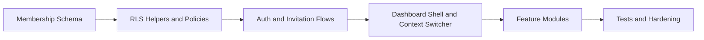

# 06 - Implementation Roadmap

## 1. Guiding Order

Implement the authorization model before building role dashboards. The old single-role model must not become the foundation for application code.

Critical path:



## 2. Phase 0 - Auth and RBAC Foundation

**Architecture review migrations (20240109000000–20240109000010):** `user_identities` + `handle_new_user` email identity (REC-01); `notification_deliveries` (REC-02); `audit_logs` + `record_audit_event` + archive (REC-03); `platform_admins` + `organizations.suspended_at` (REC-04); archival pg_cron jobs (REC-05); buildings RLS fix (REC-06); tickets RLS fix (REC-07); org-level owner invitations (REC-09); `archived_at` columns (REC-13); subscription tables + `check_property_limit` (REC-14); activity feed views (§13).

Deliverables:

- Create `membership_role` and `invitation_status` enums.
- Create `memberships`, `invitations`, and `tenant_profiles`.
- Remove the design dependency on `profiles.role`, `organization_members`, `property_staff`, and `properties.manager_id`.
- Add indexes for membership lookups, invitation validation, and tenant room occupancy.
- Add partial unique indexes on memberships, org-consistency trigger, and last-owner deactivation guard.
- Denormalize `organization_id` onto `tenant_profiles`, `billing_periods`, `meter_readings`, and `housekeeping_tasks`.
- Add RLS helper functions around memberships; inline predicates in row-level policies (no `can_access_property` in `USING` clauses).
- Add `invitations_archive` and `notifications_archive` tables with `pg_cron` archival jobs.
- Mandate keyset pagination helpers for all list views.
- Add pgTAP tests for cross-organization and cross-property denial.
- Regenerate Supabase types after migrations.
- Create `platform_admins` table (outside `memberships`; keyed on `auth.users.id`, includes `granted_by`, `revoked_at`).
- Add `suspended_at timestamptz` to `organizations`.
- Add `is_platform_admin()` SECURITY DEFINER helper; exclude platform admins from org-scoped RLS policies — platform admin queries must run via service-role endpoints only.
- Create `audit_logs` table with `actor_id`, `organization_id`, `property_id`, `event_type`, `metadata jsonb`, `created_at`. Revoke UPDATE/DELETE grants at schema level — records are INSERT-only.
- Add composite indexes on `audit_logs(organization_id, created_at desc)` and `(property_id, created_at desc)`.
- **Migration**: `user_identities` table with RLS (provider-based identity; supports email, LINE, Google, Apple without schema changes).
- **Migration**: `notifications` and `notification_deliveries` tables — schema only; no delivery logic yet.
- **Architecture**: User Identity Layer documented in `02-system-architecture.md` §3.1.
- **Architecture**: Notification architecture documented in `02-system-architecture.md` §3.2.
- **Trigger**: `handle_new_user` inserts an `email` row into `user_identities` for every new registration.

Schema additions (Phase 0 migration):

```sql
create table public.platform_admins (
  id          uuid primary key default gen_random_uuid(),
  user_id     uuid not null unique references auth.users(id) on delete cascade,
  granted_by  uuid references auth.users(id) on delete set null,
  created_at  timestamptz not null default now(),
  revoked_at  timestamptz
);

alter table public.organizations
  add column suspended_at timestamptz;

create table public.audit_logs (
  id              uuid primary key default gen_random_uuid(),
  actor_id        uuid references auth.users(id) on delete set null,
  organization_id uuid references public.organizations(id) on delete set null,
  property_id     uuid references public.properties(id) on delete set null,
  event_type      text not null,
  metadata        jsonb not null default '{}',
  created_at      timestamptz not null default now()
);

create index idx_audit_logs_org_created      on public.audit_logs (organization_id, created_at desc);
create index idx_audit_logs_property_created on public.audit_logs (property_id, created_at desc);
create index idx_audit_logs_event_type       on public.audit_logs (event_type, created_at desc);

revoke update, delete on public.audit_logs from authenticated;
```

Exit criteria:

- Owner signup creates organization, first property, and owner membership.
- Staff invitations create memberships only after acceptance.
- Tenant activation creates tenant membership and tenant profile.
- RLS denies access outside the user's memberships.
- Platform admin can view all organizations and suspend one without belonging to any membership.
- Critical business events produce an immutable `audit_logs` row.

## 3. Phase 1 - Auth UI and Context

Deliverables:

- Owner registration and onboarding screens.
- Invite acceptance and password setup screens.
- Tenant activation screens.
- Membership/property/role switcher.
- `habio-active-membership` signed cookie.
- Middleware route guard with `validateMembershipById` fast path (full membership list only on context switch).
- **LINE linking**: Account linking page at `/[role]/account/link-line` for all five roles (owner, manager, technician, housekeeper, tenant).
- **Server actions**: `linkLineIdentity` and `unlinkLineIdentity` in `src/lib/actions/identity.ts`.
- **UI**: Display LINE linked/unlinked status in account settings for all roles.
- **Notifications**: `in_app` channel activated — notifications inbox reads from `notifications` + `notification_deliveries`.

Exit criteria:

- Multi-role users can switch context.
- Wrong role route redirects to active role dashboard.
- Users with no memberships cannot access dashboards.
- Any role can link a LINE account after authentication; linking does not grant access without a membership.
- In-app notification inbox reads from `notifications` with per-channel delivery state in `notification_deliveries`.

## 4. Phase 2 - Organization and Property Core

Deliverables:

- Owner organization settings.
- Property CRUD.
- Building CRUD.
- Room CRUD and archive.
- Manager property assignment through memberships.
- Apply archival strategy (§11) to `properties`, `buildings`, and `rooms` — add `archived_at` columns; default RLS and list queries exclude `archived_at is not null` rows.

Exit criteria:

- Owners can manage all organization properties.
- Managers see and modify only assigned properties.
- Cross-property room access is denied by RLS.

## 5. Phase 2.5 - Subscription and SaaS Management

Deliverables:

- `subscription_plans` table (name, max_properties, max_rooms_per_property, features jsonb).
- `organization_subscriptions` table (organization_id, plan_id, status, billing_cycle, current_period_start, current_period_end, trial_ends_at, cancelled_at).
- `usage_counters` table (organization_id, metric, count, period_start) — primary key on (organization_id, metric, period_start).
- Server Actions to check and increment usage counters before property/room creation.
- Feature-gate helper `is_feature_enabled(org_id, feature_key)` for plan-based access control in Server Actions (not in RLS).
- Platform admin UI: view subscription status per organization, override plan limits.

Plans:

- free: max 1 property, limited rooms per property
- starter: limited properties, limited rooms per property
- pro: unlimited properties, unlimited rooms
- enterprise: custom limits via features jsonb override

Schema additions (Phase 2.5 migration):

```sql
create table public.subscription_plans (
  id                      uuid primary key default gen_random_uuid(),
  name                    text not null unique,
  max_properties          integer,          -- null = unlimited
  max_rooms_per_property  integer,          -- null = unlimited
  features                jsonb not null default '{}',
  created_at              timestamptz not null default now()
);

create table public.organization_subscriptions (
  id                    uuid primary key default gen_random_uuid(),
  organization_id       uuid not null unique references public.organizations(id) on delete cascade,
  plan_id               uuid not null references public.subscription_plans(id),
  status                text not null default 'active',
  billing_cycle         text not null default 'monthly',
  current_period_start  date not null,
  current_period_end    date not null,
  trial_ends_at         timestamptz,
  cancelled_at          timestamptz,
  created_at            timestamptz not null default now(),
  updated_at            timestamptz not null default now()
);

create table public.usage_counters (
  organization_id  uuid not null references public.organizations(id) on delete cascade,
  metric           text not null,
  count            integer not null default 0,
  period_start     date not null,
  updated_at       timestamptz not null default now(),
  primary key (organization_id, metric, period_start)
);
```

Exit criteria:

- Every organization has an `organization_subscriptions` row.
- Property creation is blocked when `max_properties` limit is reached.
- Room creation is blocked when `max_rooms_per_property` limit is reached.
- Plan limits are enforced in Server Actions; RLS does not enforce plan limits.

## 6. Phase 3 - Tenant and Billing

Deliverables:

- Manager-created tenant activation.
- Tenant profile management.
- Lease lifecycle.
- Billing periods.
- Bills and bill line items.
- Tenant bill view.

Exit criteria:

- Managers can manage tenants only in assigned properties.
- Tenants see only their own room and bills.
- Occupancy constraints prevent two active tenants in one room.
- `tenant_created`, `tenant_updated`, `bill_created`, and `bill_paid` events produce `audit_logs` rows.

## 7. Phase 4 - Operations

Deliverables:

- Maintenance tickets and comments.
- Technician assignment and status updates.
- Housekeeping tasks.
- Meter readings and manager approval.
- Notifications.

Exit criteria:

- Technicians see only assigned jobs.
- Housekeepers see only assigned tasks and scoped meter readings.
- Owners and managers have property-scoped operational dashboards.
- `maintenance_ticket_created`, `maintenance_ticket_closed`, `membership_added`, and `membership_removed` events produce `audit_logs` rows.
- Activity feed queries against `audit_logs` are indexed and performant at property scope.

## 8. Phase 5 — LINE Messaging, Push Notifications, and Realtime

> **Schema dependency:** The `user_identities` and `notification_deliveries` tables required by Phase 5 are already in place from Phase 0. LINE Messaging API, webhooks, push notification delivery, Rich Menu, and LIFF are deferred to this phase.

Deliverables:

- LINE Messaging API integration.
- LINE push notifications (writes `notification_deliveries` rows with `channel = 'line'`).
- LINE webhook processing with HMAC-SHA256 signature validation.
- Realtime notification channels.
- Ticket attachment storage policies.
- Rich Menu and LIFF (mobile task views for staff and tenants).

Exit criteria:

- Storage and Realtime policies mirror membership-based access.
- LINE webhook uses server-side validation and service-role writes only where needed.

## 9. Phase 6 - Security and Launch Hardening

Deliverables:

- Supabase advisors clean or documented.
- RLS test suite in CI.
- Invitation expiry job (pending to expired).
- Membership deactivation workflows (respect last-owner guard).
- Audit review of `SECURITY DEFINER` functions and execute grants.
- Performance review of membership helper indexes.

Exit criteria:

- No known cross-organization data paths.
- No client-side service role exposure.
- Multi-role user journeys are covered by tests.

## 10. Pagination Standard

All list views use keyset (cursor-based) pagination. Offset pagination is not permitted on operational tables.

```sql
-- Example: bills list for a property
select *
from public.bills
where property_id = $1
  and (created_at, id) < ($cursor_created_at, $cursor_id)
order by created_at desc, id desc
limit 20;
```

Application helpers should accept an opaque cursor encoding `(created_at, id)` and return `next_cursor` in the response.

## 11. Soft Delete and Archival Strategy

Use `archived_at` for business records that must remain queryable for history, reporting, or audit trail. Use `deleted_at` only when the row must be logically invisible but cannot be hard-deleted (e.g., a user who has audit associations). Never hard-delete operational data.

Rules:

- `archived_at`: set when an entity is retired from active use. Default RLS and list queries add `WHERE archived_at IS NULL`. The record remains readable by owners, managers, and platform admins.
- `deleted_at`: reserved for compliance-only soft deletion. Not used in v1.
- Hard deletes are forbidden on: properties, buildings, rooms, bills, maintenance_tickets, housekeeping_tasks, tenant_profiles, memberships.

Tables requiring `archived_at` (add in Phase 0 or Phase 2 as applicable):

- properties
- buildings
- rooms (already present)
- bills
- maintenance_tickets
- housekeeping_tasks
- tenant_profiles (already present)

RLS and query pattern:

- Every list policy and application query must filter `WHERE archived_at IS NULL`.
- Archive actions are owner- or manager-only mutations setting `archived_at = now()`.
- Archival is not reversible without an explicit unarchive action (owner-only).

## 12. Audit Logging Standard

`audit_logs` is INSERT-only. UPDATE and DELETE grants are revoked at schema level.

Tracked event types (minimum MVP set):

- tenant_created
- tenant_updated
- bill_created
- bill_paid
- maintenance_ticket_created
- maintenance_ticket_closed
- housekeeping_task_completed
- meter_reading_approved
- membership_added
- membership_removed
- property_archived
- organization_suspended

Each row must include:

- `actor_id`: auth.users.id of the performing user (null for system jobs)
- `organization_id`: scoping org (required for all non-platform events)
- `property_id`: scoping property (nullable for org-level events)
- `event_type`: one of the tracked event types above
- `metadata`: jsonb snapshot of relevant identifiers and before/after values

RLS:

- Owners can SELECT `audit_logs` WHERE `organization_id` matches their membership.
- Managers can SELECT `audit_logs` WHERE `property_id` matches their membership.
- Platform admins can SELECT all rows via service-role endpoint.
- No authenticated role may UPDATE or DELETE `audit_logs`.

Exit criteria:

- Critical business actions produce audit rows in the same transaction.
- Audit records are queryable by organization and property with index-only scans.
- No UPDATE or DELETE on `audit_logs` succeeds from any authenticated session.

## 13. Activity Feed Foundation

Activity feeds are read views over `audit_logs`. Do not create a separate `activity_events` table; derive feeds from `audit_logs` using indexed queries.

Suggested views (implemented in Phase 4 or Phase 2.5):

```sql
create view public.organization_activity_feed as
  select id, actor_id, organization_id, property_id, event_type, metadata, created_at
  from public.audit_logs
  where organization_id is not null
  order by created_at desc;

create view public.property_activity_feed as
  select id, actor_id, organization_id, property_id, event_type, metadata, created_at
  from public.audit_logs
  where property_id is not null
  order by created_at desc;
```

Application queries paginate via keyset on `(created_at, id)` — see §10.

Feed event display examples:

- tenant_activated → "Tenant [name] activated in Room [number]"
- bill_paid → "Bill [amount] paid by [tenant]"
- ticket_assigned → "Ticket #[id] assigned to [technician]"
- ticket_closed → "Ticket #[id] closed"
- meter_approved → "Meter reading for Room [number] approved"

Dashboard integration: owner and manager dashboards include a property-scoped activity feed widget in Phase 4. Org-level feed added in Phase 6.

## 14. Migration Checklist

| Step | Action |
|---|---|
| 1 | Add new enums and tables additively. |
| 2 | Backfill legacy org owners, property managers, staff, and tenants into memberships. |
| 3 | Create tenant profiles from legacy tenants. |
| 4 | Add partial unique indexes, org-consistency and last-owner triggers, `organization_id` denormalization, and archival tables. |
| 5 | Replace old RLS helpers and policies. |
| 6 | Regenerate TypeScript database types. |
| 7 | Update seed data and pgTAP tests. |
| 8 | Drop legacy role and access columns/tables after verification. |
| 9 | Create `platform_admins`, add `organizations.suspended_at`, create `audit_logs` with revoked UPDATE/DELETE grants. |
| 10 | Create `subscription_plans`, `organization_subscriptions`, `usage_counters`; seed default plan rows. |
| 11 | Backfill `organization_subscriptions` for all existing organizations (assign free plan). |
| 12 | Add `archived_at` to `properties`, `buildings`, `bills`, `maintenance_tickets`, `housekeeping_tasks`; update RLS policies and list queries. |
| 13 | Create `organization_activity_feed` and `property_activity_feed` views. |

## 15. Major Risks

- RLS recursion around `memberships` if policies read the same table directly.
- Multi-role UX confusion if the active context is hidden.
- Partial tenant activation if membership, tenant profile, and room update are not transactional.
- Invitation token leakage through logs.
- Performance regressions if membership and property foreign keys are not indexed.
- Offset pagination on large operational tables (`bills`, `maintenance_tickets`, `notifications`).
- Unbounded `invitations` and `notifications` table growth without archival.
- Middleware loading all memberships per request for users with many property assignments.
- Subscription limit bypass: Server Action usage check and counter increment are not atomic; a concurrent property creation can pass the limit check before the counter is updated. Mitigation: use `SELECT … FOR UPDATE` on `usage_counters` or increment in a single `UPDATE … RETURNING` with a limit guard.
- Missing audit trail for critical actions: a Server Action that mutates data without writing to `audit_logs` in the same transaction loses the record permanently. Mitigation: shared `recordAuditEvent(tx, event)` helper called inside every mutating transaction; pgTAP test asserts audit row exists after key actions.
- Platform admin privilege escalation: if `platform_admins` is readable or writable by authenticated sessions, a user could grant themselves admin access. Mitigation: `platform_admins` table has no RLS SELECT/INSERT policy for authenticated; all reads and writes use service-role only.
- Excessive audit log growth: at 100,000 tenants generating ~20 auditable events per month, `audit_logs` accumulates ~2M rows/month. Mitigation: add `audit_logs_archive` table and weekly `pg_cron` job archiving rows older than 180 days; retain indexes on the live table for recent queries only.
- Activity feed query performance: `organization_activity_feed` view without a covering index degrades under high event volume. Mitigation: enforce keyset pagination; add partial index on `(organization_id, created_at desc)` and `(property_id, created_at desc)` in Phase 0; benchmark at 1M rows before Phase 4 dashboard integration.
