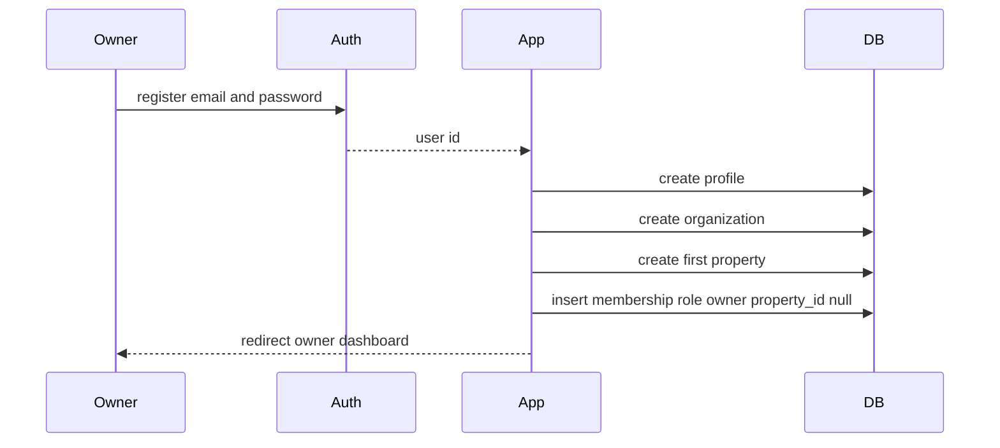
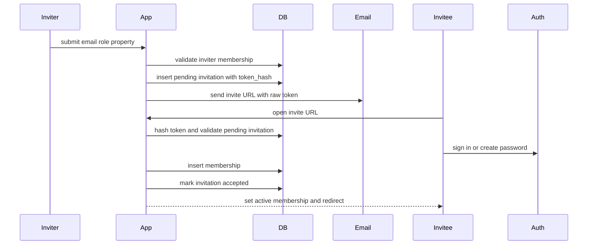
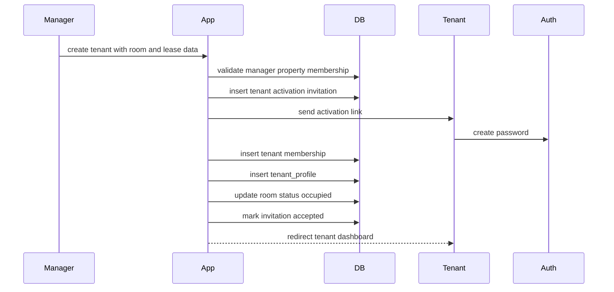

# Auth and Invitation Flow

## 1. Goals

Habio separates identity from access. Supabase Auth creates users; Habio creates memberships after a trusted flow proves the user is allowed to join an organization or property.

Rules:

- Owners may register directly and create a new organization.
- Managers, technicians, and housekeepers must be invited.
- Tenants are created by managers and activated through a room assignment.
- Roles are stored only in `memberships`.
- Invitations are single-use, expiring, and revocable.

## 2. Owner Signup

Transaction requirements:

1. Create organization.
2. Create first property.
3. Create `memberships` row with `role = 'owner'`, same `organization_id`, and `property_id = null`.
4. Set active membership cookie.

If any step fails after Auth signup, route the user to onboarding recovery instead of creating a partial organization silently.

## 3. Staff Invitation Flow

Eligible inviters:

| Invited role | Who can invite |
|---|---|
| `manager` | Owner |
| `technician` | Owner or manager of the target property |
| `housekeeper` | Owner or manager of the target property |

Flow:

Validation rules:

- `status = 'pending'`.
- `expires_at > now()`.
- `token_hash = sha256(raw_token)`.
- Invite email matches the authenticated user's email, case-insensitively.
- `property_id` belongs to `organization_id`.
- The inviter still has permission when the invitation is accepted if strict revocation is required.

## 4. Tenant Activation Flow

Managers create tenants from the property dashboard.

Tenant activation should run in one transaction or RPC because it creates multiple dependent rows.

## 5. Invitation Statuses

| Status | Meaning |
|---|---|
| `pending` | Link has been issued and can still be accepted |
| `accepted` | Link was redeemed and membership was created |
| `expired` | Link passed `expires_at` before redemption |
| `revoked` | Authorized user cancelled the invitation |

Recommended default expiry: 7 days.

## 6. Token Security

- Generate a high-entropy random token for the URL.
- Store only `token_hash`, never the raw token.
- Compare hashes server-side.
- Treat tokens as bearer secrets and avoid logging request URLs on invite routes.
- Mark accepted/revoked/expired invitations unusable.
- Rate-limit token validation attempts by IP and email.

## 7. Existing Users

If an invited email already belongs to a Supabase Auth user, the user signs in and accepts the invitation. The flow still creates a new membership, allowing one user to hold multiple roles across multiple properties.

## 8. Revocation and Deactivation

Revoking an invitation does not affect existing memberships. Removing access from an existing user sets `memberships.deactivated_at`. Tenant lease end archives or terminates `tenant_profiles` and deactivates the tenant membership when access should stop.

## 9. Error States

| Error | User-facing behavior |
|---|---|
| Invalid token | Show expired/invalid invite page |
| Expired token | Offer to request a new invitation |
| Email mismatch | Ask user to sign in with the invited email |
| Room already occupied | Block activation and notify manager |
| Membership already exists | Mark invitation accepted and redirect to context switcher |
