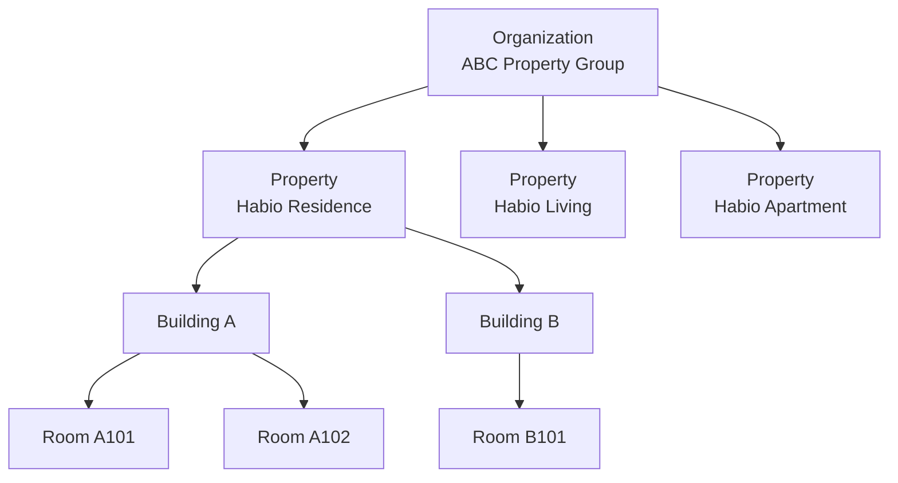
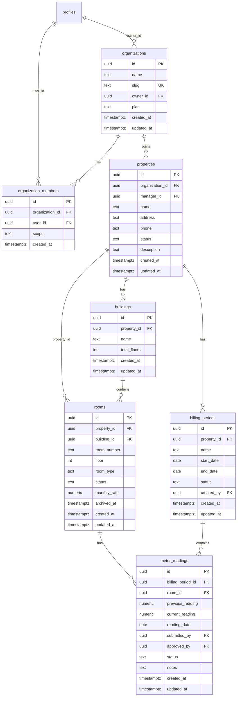
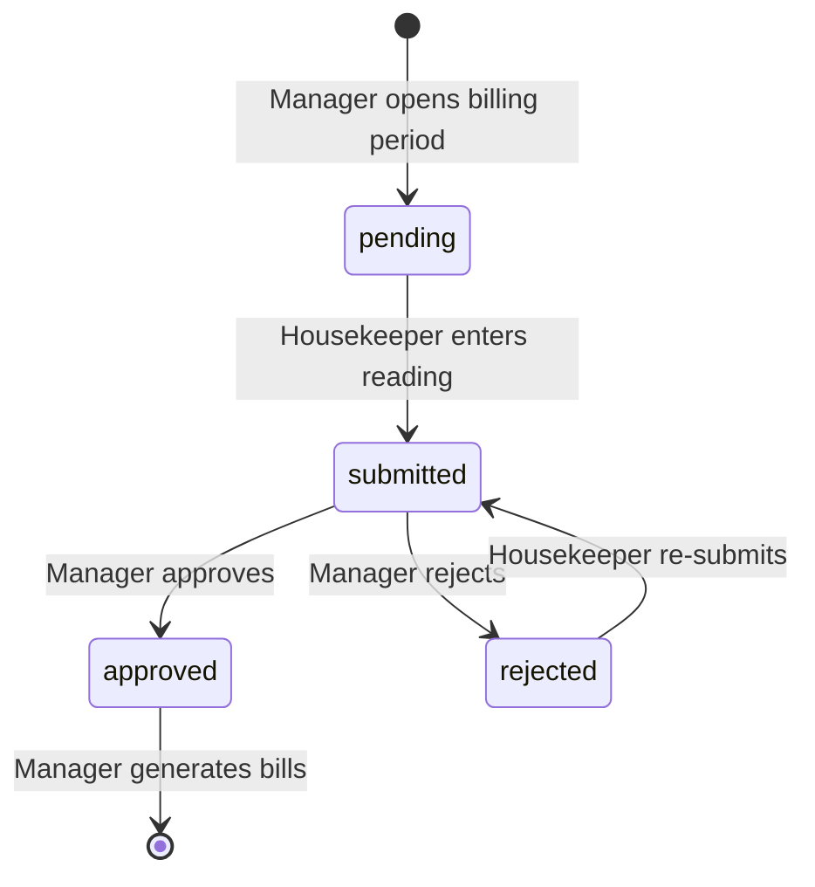

# Multi-Property Architecture

> **Status**: Design document — documentation only; no implementation code yet.
> See also: [01-requirements.md](./01-requirements.md), [03-database-schema.md](./03-database-schema.md), [04-rbac.md](./04-rbac.md)

---

## 1. Executive Summary

Habio is evolving from a **single-property dormitory management system** into a **multi-property SaaS platform**. The current schema treats `properties` as the top-level tenant boundary — one manager owns one property, rooms belong directly to that property.

The target hierarchy introduces three new layers above the existing room-centric model:

```
Organization
└── Property
    └── Building
        └── Room
```

This document is the authoritative reference for the multi-property refactor. It covers architecture rationale, schema changes, RBAC updates, migration strategy, API design, folder structure, and future SaaS considerations.

---

## 2. Architecture Review

### 2.1 Current State

| Aspect | Current design |
|---|---|
| Top-level entity | `properties` (one dormitory per row) |
| Manager access | `properties.manager_id = auth.uid()` |
| Room parent | `rooms.property_id` directly |
| Staff assignment | `property_staff` (technician / housekeeper per property) |
| Multi-tenancy | Shared schema + `property_id` RLS discriminator |
| App phase | Phase 1 complete (auth, middleware, empty dashboards) |

The existing design already supports **multiple properties per manager** at the database level (`properties.manager_id` is not unique). What it lacks is:

1. **Organizational grouping** — no way to represent "ABC Property Group" owning Habio Residence, Habio Living, and Habio Apartment
2. **Building layer** — no way to group rooms into Building A / Building B within a property
3. **Org-level RBAC** — no concept of an org admin who manages all properties without being the direct `manager_id` on each
4. **Meter reading workflow** — no `billing_periods` or `meter_readings` tables

### 2.2 Target State

| Aspect | Target design |
|---|---|
| Top-level entity | `organizations` |
| Property grouping | `properties.organization_id` |
| Building layer | `buildings` between property and room |
| Manager access | Direct `manager_id` **or** `organization_members` with `owner`/`admin` scope |
| Room parent | `rooms.building_id` + denormalized `rooms.property_id` |
| Meter readings | `billing_periods` → `meter_readings` → bill generation |

### 2.3 Design Decisions

| Decision | Rationale |
|---|---|
| Keep `profiles.role` as the single role enum | Role describes *what the user does* (manager, tenant, etc.); org scope is a separate dimension via `organization_members` |
| Denormalize `property_id` on `rooms` | RLS policies on operational tables already filter by `property_id`; joining through `buildings` on every policy adds latency and complexity |
| `organization_members.scope` separate from `profiles.role` | A manager can be org `owner` without changing their profile role; org `viewer` can be a read-only auditor |
| One default building per property during migration | Backward-compatible; existing single-building properties map cleanly to "Main Building" |
| `billing_periods` at property scope | Utility billing is typically property-wide; meter readings are per room within a period |

### 2.4 What Does Not Change

- Supabase Auth (email/password, cookie sessions)
- Two-layer RBAC (middleware + RLS)
- Role cache cookie (`habio-role-cache`)
- Server Actions for mutations (no REST API layer)
- `property_staff` for technician/housekeeper assignment
- `property_id` on all operational tables (`tenants`, `bills`, `maintenance_tickets`, etc.)

---

## 3. Entity Hierarchy

### 3.1 Hierarchy Diagram



### 3.2 Entity Responsibilities

| Entity | Responsibility | Example |
|---|---|---|
| **Organization** | Legal/business entity; billing plan; owns properties | ABC Property Group |
| **Property** | A dormitory site with address, phone, status | Habio Residence |
| **Building** | Physical structure within a property | Building A, Building B |
| **Room** | Rentable unit | A101, A102, B101 |

### 3.3 Relationship Rules

| Parent | Child | Cardinality | Notes |
|---|---|---|---|
| `organizations` | `properties` | 1:N | Every property belongs to exactly one org |
| `organizations` | `organization_members` | 1:N | Users with org-level access |
| `properties` | `buildings` | 1:N | At least one building per property |
| `buildings` | `rooms` | 1:N | Room numbers unique per property (not per building) |
| `properties` | `billing_periods` | 1:N | One open period at a time per property (app-enforced) |
| `billing_periods` | `meter_readings` | 1:N | One reading per room per period |
| `rooms` | `tenants`, `bills`, `tickets`, `tasks` | 1:N | Unchanged; still scoped via `property_id` + `room_id` |

---

## 4. Updated ERD



Full table definitions for all entities (including unchanged tables) are in [03-database-schema.md](./03-database-schema.md).

---

## 5. Updated Database Schema (Summary)

### 5.1 New Tables

| Table | Purpose |
|---|---|
| `organizations` | Top-level SaaS tenant; owns properties |
| `organization_members` | Org-level access (owner, admin, viewer) |
| `buildings` | Physical structures within a property |
| `billing_periods` | Utility billing cycles per property |
| `meter_readings` | Per-room meter readings within a billing period |

### 5.2 New Enums

```sql
CREATE TYPE public.organization_member_scope AS ENUM ('owner', 'admin', 'viewer');
CREATE TYPE public.property_status AS ENUM ('active', 'inactive', 'archived');
CREATE TYPE public.billing_period_status AS ENUM ('open', 'closed', 'archived');
CREATE TYPE public.meter_reading_status AS ENUM ('pending', 'submitted', 'approved', 'rejected');
```

### 5.3 Modified Tables

**`properties`** — add columns:

| Column | Type | Notes |
|---|---|---|
| `organization_id` | `uuid NOT NULL` | FK → `organizations(id)` |
| `phone` | `text` | Contact number |
| `status` | `property_status` | Default `active` |

**`rooms`** — add column:

| Column | Type | Notes |
|---|---|---|
| `building_id` | `uuid NOT NULL` | FK → `buildings(id)`; denormalized `property_id` retained |

### 5.4 New Helper Functions

```sql
-- Returns true if the current user has org-level access (owner or admin)
CREATE OR REPLACE FUNCTION public.is_organization_admin(p_org_id uuid)
RETURNS boolean ...

-- Extended property manager check: direct manager_id OR org admin
CREATE OR REPLACE FUNCTION public.is_property_manager(p_property_id uuid)
RETURNS boolean ...

-- Returns true if user is assigned staff at the property
CREATE OR REPLACE FUNCTION public.is_property_staff(p_property_id uuid)
RETURNS boolean ...

-- Returns property IDs the current user can manage
CREATE OR REPLACE FUNCTION public.get_managed_property_ids()
RETURNS SETOF uuid ...
```

See [04-rbac.md](./04-rbac.md) for full SQL definitions.

---

## 6. Updated RBAC Design

### 6.1 Two Dimensions of Access

Habio RBAC now has two orthogonal dimensions:

| Dimension | Storage | Examples |
|---|---|---|
| **Functional role** | `profiles.role` | manager, tenant, technician, housekeeper |
| **Org scope** | `organization_members.scope` | owner, admin, viewer |

A user with `profiles.role = 'manager'` who is also `organization_members.scope = 'owner'` can manage all properties in that organization, even if they are not the direct `manager_id` on every property.

### 6.2 Manager Access Patterns

| Pattern | Mechanism | Use case |
|---|---|---|
| Single property | `properties.manager_id = auth.uid()` | Independent dormitory operator |
| Multiple properties (same org) | `organization_members.scope IN ('owner','admin')` | Property group with dedicated managers per site |
| Entire organization | `organization_members.scope = 'owner'` | HQ admin overseeing all properties |

### 6.3 Staff Access (Technician / Housekeeper)

- Assigned via `property_staff` (unchanged)
- Can only see data within their assigned properties
- Housekeepers additionally submit meter readings for assigned properties
- Technicians and housekeepers do **not** use `organization_members`

### 6.4 Tenant Access

- Scoped to their active room (unchanged)
- No org or property-level visibility beyond their own lease

### 6.5 Access Matrix (New Resources)

| Resource | Org owner/admin | Property manager | Technician | Housekeeper | Tenant |
|---|:---:|:---:|:---:|:---:|:---:|
| `organizations` | CRUD | R (own org) | — | — | — |
| `organization_members` | CRUD | — | — | — | — |
| `buildings` | CRUD | CRUD | R | R | R (own) |
| `billing_periods` | CRUD | CRUD | — | R | — |
| `meter_readings` | CRUD | CRU (approve) | — | CRU (submit) | — |

Full permission matrix: [04-rbac.md](./04-rbac.md).

---

## 7. Meter Reading Module

### 7.1 Workflow



### 7.2 Roles

| Role | Actions |
|---|---|
| **Manager** | Create/close billing periods; review readings; approve/reject; generate bills from approved readings |
| **Housekeeper** | View open periods for assigned properties; enter readings by property or building; submit readings |

### 7.3 Bill Generation Flow

1. Manager creates a `billing_period` for a property (status: `open`)
2. System pre-creates `meter_readings` rows (status: `pending`) for all occupied rooms, with `previous_reading` from the last approved reading
3. Housekeeper enters `current_reading` and submits (status: `submitted`)
4. Manager reviews and approves (status: `approved`)
5. Manager triggers bill generation — utility line items added to tenant bills based on `(current_reading - previous_reading) × rate`

### 7.4 Constraints

- One reading per room per billing period (`UNIQUE (billing_period_id, room_id)`)
- Readings immutable when billing period is `closed` or `archived`
- Only housekeepers assigned to the property via `property_staff` can submit readings

---

## 8. API Design

Habio uses **Server Actions**, not a REST API. The multi-property refactor adds the following action groups:

### 8.1 Organizations

| Action | Description |
|---|---|
| `createOrganization` | Create org + set caller as `owner` |
| `updateOrganization` | Update name, slug (owner/admin) |
| `inviteOrgMember` | Add user with scope (owner only) |
| `removeOrgMember` | Remove member (owner only) |

### 8.2 Properties

| Action | Description |
|---|---|
| `createProperty` | Create property under org |
| `updateProperty` | Update name, address, phone, status |
| `archiveProperty` | Set status to `archived` |

### 8.3 Buildings

| Action | Description |
|---|---|
| `createBuilding` | Create building under property |
| `updateBuilding` | Update name, total_floors |
| `deleteBuilding` | Delete if no rooms (or archive) |

### 8.4 Meter Readings

| Action | Description |
|---|---|
| `createBillingPeriod` | Open a new billing period |
| `closeBillingPeriod` | Close period (no more submissions) |
| `submitMeterReading` | Housekeeper submits reading |
| `approveMeterReading` | Manager approves |
| `rejectMeterReading` | Manager rejects with notes |
| `generateBillsFromReadings` | Create utility line items on tenant bills |

### 8.5 Route Handlers (unchanged)

| Route | Purpose |
|---|---|
| `GET /auth/callback` | Supabase auth callback |
| `POST /api/webhooks/line` | LINE webhook (no session) |

### 8.6 Property Context in Requests

Manager routes use a **property context** pattern:

```
/manager/properties/[propertyId]/rooms
/manager/properties/[propertyId]/buildings/[buildingId]/rooms
/manager/properties/[propertyId]/meter-readings
```

Server Actions receive `propertyId` as a parameter and validate access via `is_property_manager(propertyId)` before any mutation.

---

## 9. Folder Structure

See [05-folder-structure.md](./05-folder-structure.md) for the full directory tree.

Key additions:

```
src/
├── app/(dashboard)/manager/
│   ├── organizations/
│   │   └── [organizationId]/
│   ├── properties/
│   │   └── [propertyId]/
│   │       ├── buildings/
│   │       │   └── [buildingId]/rooms/
│   │       └── meter-readings/
│   └── ...
├── components/
│   ├── organizations/
│   ├── properties/
│   ├── buildings/
│   └── meter-readings/
└── lib/
    ├── actions/
    │   ├── organizations.ts
    │   ├── properties.ts
    │   ├── buildings.ts
    │   └── meter-readings.ts
    └── queries/
        ├── organizations.ts
        ├── properties.ts
        └── meter-readings.ts
```

---

## 10. Migration Strategy

### Phase A — Non-breaking schema additions

No downtime. All new columns nullable initially.

| Step | Migration |
|---|---|
| A.1 | Create `organizations`, `organization_members` tables |
| A.2 | Create `buildings` table |
| A.3 | Add `organization_id` (nullable) to `properties` |
| A.4 | Add `phone`, `status` to `properties` |
| A.5 | Add `building_id` (nullable) to `rooms` |
| A.6 | Create `billing_periods`, `meter_readings` tables |
| A.7 | Create new enums and helper functions |

### Phase B — Data backfill

| Step | Action |
|---|---|
| B.1 | For each distinct `manager_id` in `properties`: create an `organization` named `"{first_property_name} Organization"` |
| B.2 | Insert manager as `organization_members` with `scope = 'owner'` |
| B.3 | Set `properties.organization_id` for all properties owned by that manager |
| B.4 | For each property: create a `building` named `"Main Building"` |
| B.5 | Set `rooms.building_id` to the property's default building |

### Phase C — Enforce constraints

| Step | Action |
|---|---|
| C.1 | `ALTER properties.organization_id SET NOT NULL` |
| C.2 | `ALTER rooms.building_id SET NOT NULL` |
| C.3 | Update `is_property_manager()` to include org admin check |
| C.4 | Add RLS policies for new tables |
| C.5 | Update existing RLS policies that reference `is_property_manager` (automatic via function replacement) |

### Phase D — Application layer

| Step | Action |
|---|---|
| D.1 | Regenerate `src/types/database.ts` |
| D.2 | Add org/building/meter-reading routes and components |
| D.3 | Update seed data with org + building structure |
| D.4 | Extend pgTAP tests for new tables and policies |

### Rollback Plan

- Phase A migrations are additive — rollback by dropping new tables/columns
- Phase B backfill is idempotent — can be re-run
- Phase C constraint enforcement should only run after backfill verification query returns zero nulls

---

## 11. Future SaaS Considerations

### 11.1 Subscription & Billing (Platform-level)

| Concern | Approach |
|---|---|
| Org plans | `organizations.plan` column (`free`, `starter`, `pro`, `enterprise`) |
| Property limits | Enforced in `createProperty` Server Action based on plan |
| Usage metering | Track room count, active tenants per org for billing |
| Payment | Stripe integration (v2) — org-level subscription, not per-property |

### 11.2 Multi-Org Users

A single user profile can belong to multiple organizations (e.g., a freelance technician working for two property groups). Access is resolved per-request via `organization_members` and `property_staff` joins.

### 11.3 Custom Domains & White-labeling

- `organizations.slug` enables subdomain routing: `{slug}.habio.app`
- Future: custom domain per org via Vercel domain mapping

### 11.4 Audit Log

- Future `audit_log` table scoped to `organization_id`
- Records all CRUD on properties, rooms, bills, and org settings
- Required for enterprise compliance (SOC 2)

### 11.5 Data Residency

- Current: single Supabase region (ap-southeast-1)
- Future: org-level data residency selection for enterprise plans

### 11.6 API for Third Parties

- v1: Server Actions only (no public API)
- v2: REST/GraphQL API with org-scoped API keys for integrations (accounting, IoT meters)

### 11.7 Building-Level Features (Future)

- Floor plans and room maps per building
- Building-specific utility rates
- Per-building maintenance schedules

---

## 12. Risks & Recommendations

| ID | Risk | Severity | Recommendation |
|---|---|---|---|
| R-11 | `rooms.building_id NOT NULL` migration breaks existing data | High | Backfill "Main Building" per property before enforcing constraint |
| R-12 | RLS policy fan-out with org joins | Medium | Centralize in `is_property_manager()` helper; use `(SELECT ...)` subquery pattern |
| R-13 | Org slug collisions | Medium | `UNIQUE` constraint on `organizations.slug` + server-side validation |
| R-14 | Cross-org data leak for multi-org managers | High | RLS must check `organization_id` membership, not just `manager_id` |
| R-15 | New signups default to `tenant` role | Medium | Org creation flow explicitly upgrades caller to `manager` + org `owner` |
| R-16 | Meter readings modified after period closed | Medium | RLS `WITH CHECK` enforces `billing_period.status = 'open'` |
| R-17 | LINE notifications lack building context | Low | Keep property-scoped notifications; building context in v2 |

Full risk register: [07-risks-and-decisions.md](./07-risks-and-decisions.md).

---

## 13. Related Documents

| Document | Relevance |
|---|---|
| [01-requirements.md](./01-requirements.md) | Updated user stories for org, building, meter reading |
| [02-system-architecture.md](./02-system-architecture.md) | Updated multi-tenancy model and request lifecycle |
| [03-database-schema.md](./03-database-schema.md) | Full table definitions and indexes |
| [04-rbac.md](./04-rbac.md) | Permission matrix and RLS policies |
| [05-folder-structure.md](./05-folder-structure.md) | Updated route and component structure |
| [06-implementation-roadmap.md](./06-implementation-roadmap.md) | Phase 0 migration tasks |
| [07-risks-and-decisions.md](./07-risks-and-decisions.md) | ADR-008, ADR-009, risks R-11–R-17 |
